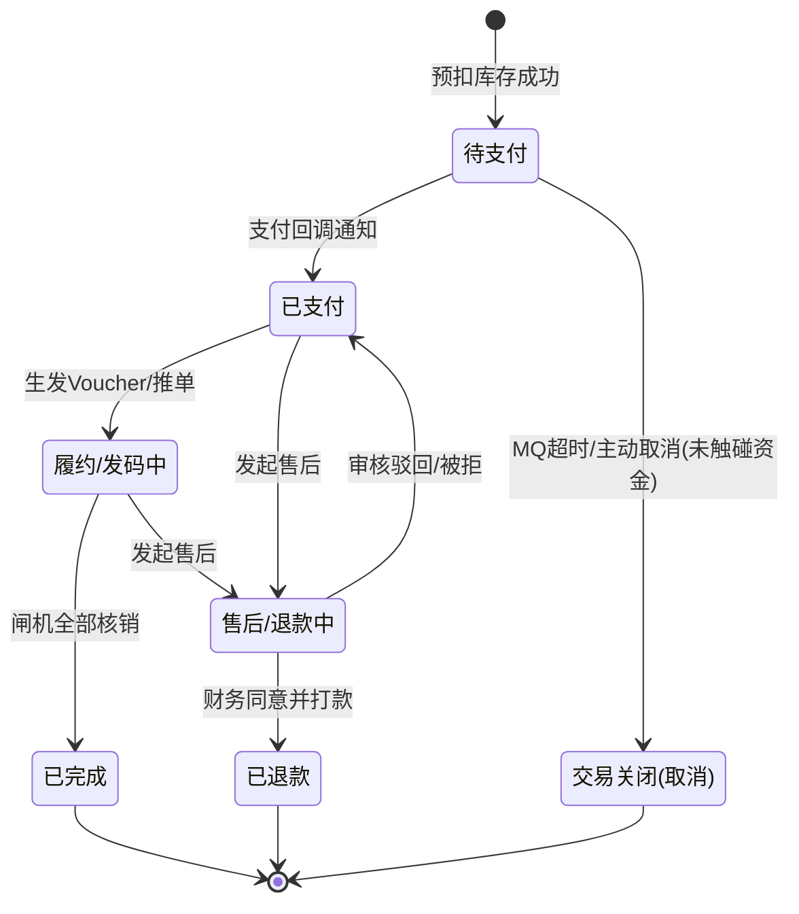

# 统一订单中心 — 最终详细架构设计指导书 (FINAL V4.0)

> **文档定位**: 指导 AI 与开发人员进行代码脚手架搭建、数据表构建与核心逻辑编写的**唯一标准纲领**。  
> **更新日期**: 2026-03-24  
> **整合来源**: OTA_TECHNICAL_DESIGN, V3.1 进阶设计, V3.2 电商化扩充, V3.3 状态机与中间件探讨, V3.4 框架锁定调。

---

## 一、 系统架构理念与模块划分

### 1.1 核心设计约束
1. **纯净的底座 (Core)**：业务核心层（订单、商品规则、退款、核销）**严禁**包含任何类似于 `douyin_app_id`、`ota_status` 的渠道专有字段。
2. **防腐适配器 (Channel)**：系统外部的流量（如抖音的 SPI 调用、美团的回调）必须在独立的 `channel` 包下被消化、验签，并转换为标准的 `StandardOrderCreateCmd` 等内部指令后，才能交给底层服务。
3. **响应式解耦 (Event-Driven)**：当核心库发生状态扭转（如：线下闸机刷验了一张票），底层不主动调用外网，而是发布 Spring 领域事件（如 `VerifySuccessEvent`）；对应的渠道适配器使用 `@EventListener` 监听后自行异步完成向外的网络回写。

### 1.2 Maven / 包结构规范

在 `plt-core-service/plt-order-service/plt-order-core` 下，包名必须严格遵守单向依赖红线（`channel ➔ core`）：

```text
cn.com.bsszxc.plt.order
├── api                     # RPC Feign客户端与外部公用的 POJO/DTO
├── core                    # 【绝对中立的核心底层】
│   ├── db                  # 通用表 Entity、Mapper
│   ├── service             # 顶层服务：OrderService, VoucherService, VerifyService, RefundService
│   ├── event               # 领域标准事件定义：VerifySuccessEvent, OrderPaidEvent
│   └── controller          # 供内部微服务、自有小程序、后台、甚至线下闸机直连的标准 API
└── channel                 # 【包含各渠道特色的防腐隔离区】
    ├── api                 # 渠道适配器标准接口 (如 ChannelAdapter)
    └── douyin              # 抖音专属适配实现 (可随时拔插)
        ├── dto             # 专属于抖音的各种 API 入参出参
        ├── strategy        # 抖音复杂场景策略路由 (GroupBuyStrategy, CalendarStrategy)
        ├── controller      # 暴露给抖音公网的 SPI 回调接口 (douyin/spi/*)
        └── adapter         # DouyinChannelAdapter (负责签名、组装、监听事件)
```

---

## 二、 核心实体与表结构推演

为了支持家庭套餐（一买多张）、优惠券分摊以及纯净的履约跟踪，采用**主子订单模型**。

### 2.1 主表: `o_order` (主订单)
**职责**：维系交易全局金额、支付手段与渠道宏观属性。
- `order_no` (varchar): 平台统一订单号
- `parent_order_id` (bigint): 父单ID，**防空指针约定：默认值为 0**。非 0 代表是被拆出的子包裹单。
- `channel_code` (varchar): 渠道标识 (如 DOUYIN, WECHAT_MINI)
- `channel_order_no` (varchar): 外部渠道侧原生流水号
- `total_amount`, `pay_amount`, `discount_amount`, `coupon_amount` (decimal): 营销与资金
- `user_id`, `user_account` (varchar): 买家信息
- `order_status` (tinyint): **单向状态机枚举** (见下文)
- `pay_type` (tinyint), `client_ip` (varchar)
- `extend_attr` (json): 扩展属性

### 2.2 子表: `o_order_item` (子订单明细)
**职责**：最小粒度的 SKU 快照及对账单据。
- `order_id` (bigint)
- `spu_id`, `sku_id` (bigint), `sku_name` (varchar): 商品精确单元
- `product_pic` (varchar): 防篡改商品快照图
- `price` (decimal), `quantity` (int)
- `coupon_amount` (decimal): 该明细精准分摊的优惠金额（用于部分退款核算）
- `refund_status` (tinyint): 售后单独状态

### 2.3 履约表: `o_voucher` (凭证) 与 `o_verify_log` (核销记录)
- **o_voucher**: 挂靠在 `o_order_item` 之下，买了几张票就生出几个 `voucher_code`。含 `status` (待使用/已使用/失效)、`valid_start_time`、`valid_end_time`。
- **o_verify_log**: 
  - `verify_channel` (varchar): 物理验证工具来源（枚举: `GATE`, `MINIAPP_SELF`, `ADMIN_MANUAL`, `DISTRIBUTOR_API`）。
  - `verify_result` (tinyint): 1-成功，0-失败。
  - `channel_notify_status` (tinyint): 通用回调状态（0-无需回写，1-待回写，2-已回写）。

### 2.4 商品与渠道配置表
- **o_product_rule**: 挂载商品底层的通用途径约束（`voucher_validity_type`, `refund_policy`）。
- **o_channel_config**: 各渠道统一密钥本 (`app_id`, `app_secret`)。
- **o_channel_product_mapping**: `platform_sku_id` ↔ `channel_external_product_id`。

---

## 三、 高可用机制与并发防线 (极度重要)

在指导 AI 或研发编码时，遇到以下业务必须采用指定的基础架构组件：

### 3.1 死守超卖防线：Redisson + RLock
- **手段**：系统现有的 `@DistributedLock` 注解。
- **实施方案**：在 `OrderService.createOrder` 核心创单切面上打上该注解（如 `@DistributedLock(keyPrefix="ORDER_STOCK:", lockKey="#cmd.skuId")`）。利用悲观分布式锁强制并发请求排队，从而安全完成 DB 的 `查库存->扣减`。
- **避坑红线修复**：在框架层使用完毕后，`finally` 块中务必增加 `lock.isHeldByCurrentThread()` 的校验，防止因 Full GC 导致的锁虚晃释放异常。

### 3.2 海量请求防刷：Redis + Lua
- 针对外部 SPI 暴露口或小程序发单口，通过网关层结合 Redis 漏桶做 `<User_id + URI>` 或 `<IP>` 维度的频率阻断。

### 3.3 无损超时关单：RocketMQ 定时消息
- **手段**：严禁采用扫表调度任务。
- **实施方案**：创单（`PENDING`）成功那一刻，向 RocketMQ 投递 `messageDelayLevel` 为 15 分钟的延迟消息（或 5.x 支持的确定时间戳消息）。
- **消费者反馈**：收到消息后根据单号重查 `o_order`，若依然为未支付，则流转为 `CANCELED` 状态并回补库存空间。

---

## 四、 标准订单正逆向状态机模型 (!核心逻辑)

代码中 `OrderStatusEnum` 必须包含并约束以下生命周期（**严格单向滚动，严禁逆流**）：



**指导要求**：凡是涉及过 `PAID` 甚至产生过资金沉淀（即便票没用过）的，不要图省事把它置回 `CANCELED`，必须通过生成 `o_refund` 逆向单据并强制流向 `REFUNDING` 来终结算。

---

## 五、 渠道防腐与策略开发指导 (以抖音为例)

抖音在对外接口方面极其零碎：**既有流程的长短区别（预订查询/无脑创单），又有业务的区别（团购vs预约）**。切记不要把所有的 `if-else` 都堆在里面：

1. **分而治之的多路调用**：
    - `DouyinGroupBuySpiController` (`/spi/douyin/groupbuy/*`) -> 针对不需要选座核对的。
    - `DouyinCalendarSpiController` (`/spi/douyin/calendar/*`) -> 针对强效期和时间片的。
2. **策略模式 (Strategy Factory)**：
    - 在 `channel/douyin/strategy` 中建立 `DouyinBizStrategy`。
    - 在适配器阶段将长短不一的 SPI 报文吸收后：
      1. `/validateOrder` 触发 `ProductRuleService.checkStock()`。
      2. `/createOrder` 触发 `OrderService.createOrder()` 并使用 `@DistributedLock`。
      3. `/issueVoucher` 触发 `VoucherService.issueVoucher()`，取得凭证。
      最后全部统一格式包装回 `DouyinSPIBaseResponse` 给外部。

---

## 结语
这份汇总架构指导涵盖了当前所有深挖需求。从底层的主子表拆单到高可用防线、状态回滚，再到针对不同 OTA 形态的适配原则。希望它在开发人员搭起 `plt-order-core` 脚手架或交予其他智能体编排 MySQL 时，能成为最坚固的设计基石。
