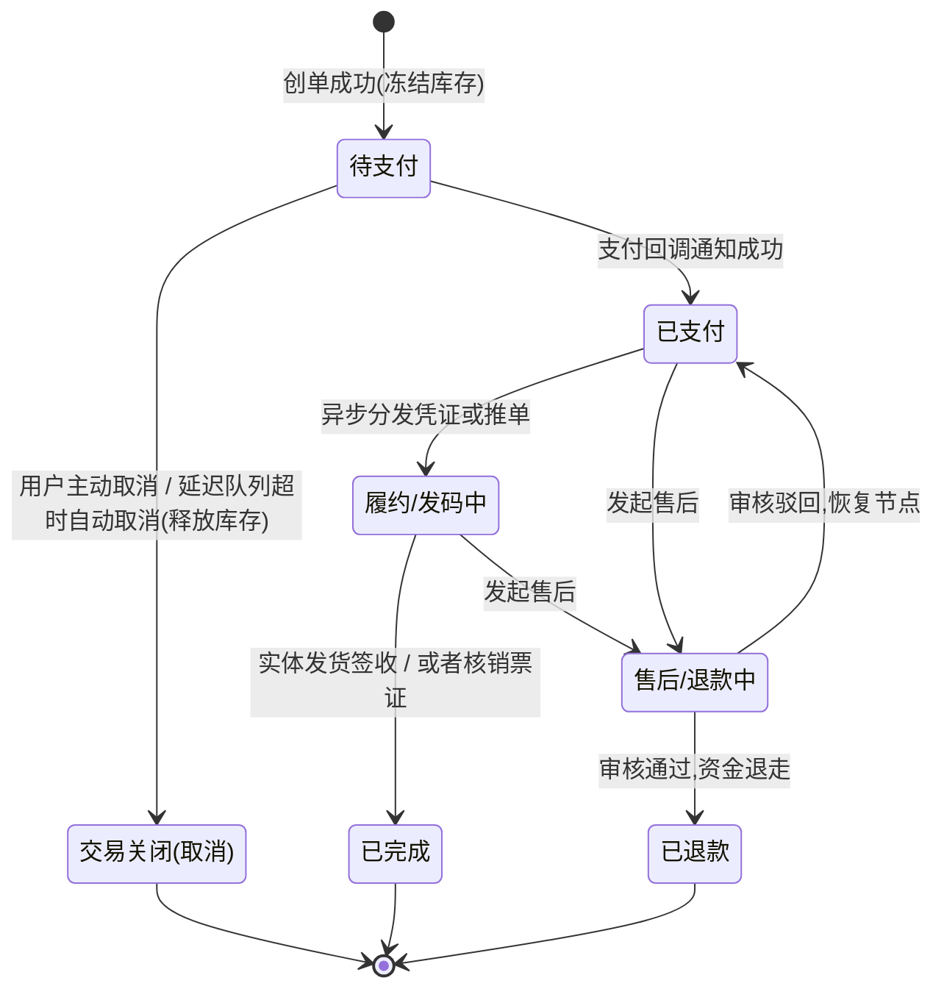

# 统一订单中心 — 极客进阶版与电商化扩充 (V3.2)

> **关联文档**: [UNIFIED_ORDER_TECHNICAL_DESIGN.md](./UNIFIED_ORDER_TECHNICAL_DESIGN.md), [UNIFIED_ORDER_ADVANCED_DESIGN.md](UNIFIED_ORDER_ADVANCED_DESIGN_V3.1.md)  
> **更新日期**: 2026-03-24  
> **核心议题**: 吸收标准电商架构（借鉴参考SQL）、高并发防御（超卖/防刷/超时）、复杂营销（折扣/优惠券）、主子订单/拆单合单抽象、及订单状态机标准定义。

---

## 1. 核心表结构补全（参考电商模型）

对比原始版本与参考 SQL，为了让“统一订单中心”真正具备接纳盲盒、实体周边、甚至多业态组合商品的能力，我们的核心表必须补全以下纯正的**电商级基础字段**：

### 1.1 `o_order` (主订单)
增加资金、营销与履约字段：
- **资金与营销**：`total_amount` (订单总额), `pay_amount` (实付金额), `discount_amount` (整体折扣减免), `coupon_amount` (优惠券抵扣金额)。
- **买家身份**：`user_id` (内部用户ID), `user_account` (内部账号/手机号)。
- **履约与拆单**：`parent_order_id` (父订单ID，为**拆单**场景预留。空代表主单，有值代表是被拆分出来的子包裹单)。
- **其它**：`pay_type` (支付方式), `client_ip` (风控防刷备用)。

### 1.2 `o_order_item` (子订单明细)
细化商品层面的履约与分摊：
- **快照信息**：`product_pic` (商品主图，快照防篡改), `sku_attr` (销售属性 JSON，如规制、日期)。
- **营销分摊**：`coupon_amount` (该明细分摊到的优惠券金额)。**注：必须分摊到子单，否则后期发生单件退款时无法计算真实应退金额。**
- **退款跟踪**：`refund_status` (子单独立的售后状态，支持部分明细退款)。

### 1.3 `verify_channel` 常量优化
同意将 `OPEN_API` 替换为更有针对性的词汇：
- `DISTRIBUTOR_API` (分销商接口API直连)
- `THIRD_PARTY_SYSTEM` (第三方票务系统对接)
- 这样能清晰区分是通过人工、线下硬件、还是纯软接口调用的。

---

## 2. 三大核心稳定性保障：防刷、超卖、超时

统一订单中心必须是高可用的，以下机制必须在架构设计时作为“标准切面”预留：

### 2.1 防刷机制 (Anti-Brush)
- **网关层拦截**：使用 Redis + Lua 脚本基于 `IP` + `User ID` 做限流机制（例如：同一账号/IP 1分钟内限制提单 5 次）。
- **业务层幂等**：针对抖/美/飞的发码回调，必须使用 `RequestId` (外部流水号) 在 Redis 做 `setnx` 锁定及防重放攻击。

### 2.2 防超卖机制 (Anti-Oversell)
- 严禁直接 `UPDATE stock = stock - 1 WHERE id = 1`，数据库的行锁在高并发下会拖垮整个连接池。
- **架构解法：Redis 预扣库存**
  1. 下单请求到达，业务层执行 Redis Lua 脚本原子性扣减库存（`HINCRBY product_stock -1`）。
  2. 扣减成功后，再异步或串行写入 MySQL 订单表。
  3. 若创单失败或支付超时，通过 MQ 消息补偿加回 Redis 库存。

### 2.3 支付超时关单 (Timeout Processing)
- **绝对不要用数据库定时任务扫描**（扫表会导致深分页和巨大的数据库压力）。
- **架构解法：延迟队列**
  订单创建（`PENDING`）后，向 RocketMQ 或 RabbitMQ 发送一条包含 15 分钟（配置化）延迟属性的消息。15分钟后消费者收到消息，根据订单号去数据库查询状态；若还是 `PENDING`，则走关单逻辑（状态置为 `CANCELED`），并将释放库存的指令抛出。

---

## 3. 抖音多场景 API 彻底兼容方案定义

抖音的**景点日历票**和**景点团购票**不仅在逻辑上有区别，它们甚至是**两套完全不同的 API 端点和报文结构**。

**架构解法：多应用映射 + 接口维度的策略路由**

在 `channel.douyin` 模块中，我们会这样设计控制器与适配器：

1. **多路 Controller 入口**：
   - `@PostMapping("/api/channel/douyin/groupbuy/spi/xxxx")` -> 指向团购专用适配器。
   - `@PostMapping("/api/channel/douyin/calendar/spi/xxxx")` -> 指向日历票/大交通专用适配器。
2. **底层适配器的组装转换**：
   - 不同的 Controller 解析出不同格式的 Request，但最终它们都必须实现一个向核心域靠拢的 `buildStandardOrderCommand()` 方法。
   - `DouyinGroupBuyAdapter` 与 `DouyinCalendarTicketAdapter` 在将外部五花八门的报文梳理干净后，**全部转换为内部的 `StandardOrderCreateCmd`**，向下扔给 `core` 包的 `OrderService`。
   - **结论**：核心系统不会为了某个特定的日历票增加奇葩的字段，所有的特殊参数（例如：抖音选座信息）全部被序列化为 JSON 塞入 `o_order_item.extend_attr` 中，核心只负责存储并透传。

---

## 4. 拆单、合单与购物车的架构预留

### 4.1 拆单与合单 (Order Splitting & Merging)
- **拆单**：当用户同时买了一张票和一个实体盲盒（需要发快递），且库存属于不同系统或物流，此时需要在支付成功后触发**拆单路由**。
  - 原订单作为父单（呈现给用户）。
  - 新生成两个子订单（`parent_order_id` 指向父单），一个推给票务系统发凭证，一个推给 WMS 发货。
- **合单支付**：购物车合并结算时，生成一个总的流水支付单（`PayOrder`），关联多个独立的业务 `o_order`，一次支付回调解冻多个订单状态。

### 4.2 购物车场景 (`o_shopping_cart` 预留)
参考业务 SQL 的设计，购物车本身是高频读写的暂存区：
- 使用 Redis Hash （`Cart:{UserId}`）进行快照高频读写，定期异步持久化到 MySQL `o_shopping_cart`。
- 购物车中的内容本质是预组装的 `o_order_item`，在点击结算时，提取购物车快照直接转化为生成订单的入参。

---

## 5. 标准电商生命周期：订单状态机设计

结合参考 SQL 的字段分布与电商通用玩法，订单的状态（`order_status`）设计须形成闭环强校验：

**关键点说明**：一旦订单跨越了 `PAID` 级，它的关闭必须走**售后/退款 (`REFUND`) 流程**，绝不能简单的调回 `CANCELED`。单据生命周期的单向性（只能往前，或进入分支流转）是保障财务对账清晰的核心底线。

---

## 6. 统一订单中心提供给全平台的核心 API 资产清单补充

针对上一版遗漏，现增补资金/支付相关的接口预留：
- `POST /api/core/order/pay-callback` (支付服务异步通知订单中心状态的内网接口)
- `POST /api/core/order/calc-price` (生单前的价格计算器，处理复杂的优惠券抵扣、满减策略计算，不落库只返回快照价格)
- `POST /api/core/cart/add` (加入购物车，后续演进预留)
