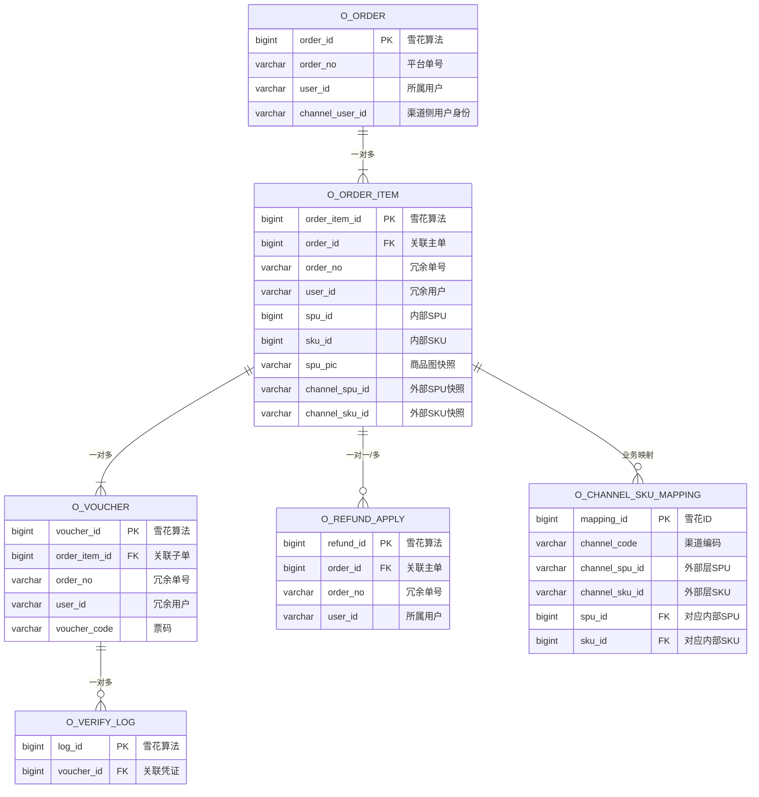

# 统一订单中心 — 数据库表结构与 ER 关系说明 (V5.1)

> **归属模块**: `plt-order-core`  
> **更新日期**: 2026-03-25  
> **配套SQL附件**: [unified_order_schema.sql](./unified_order_schema.sql)

## 一、 实体关系 (ER) 概览

统一订单中心的表结构呈现**强主从层次设计**，严格遵循电商的【主单 -> 子单 -> 履约凭证】三级降维打法。

## 二、 V5.1 核心设计标准

### 1. 全域用户追踪 (Channel User Tracking)
- **`channel_user_id`**：在 `o_order` 中增加外部渠道的用户唯一标识。
    - **逻辑说明**：虽然抖音目前传手机号，但预留该字段可适配未来传回的 `openid`。
    - **核心价值**：支持构建用户画像，识别跨平台用户行为。

### 2. 业务主键全域冗余 (Sharding Ready)
- **字段冗余**：在 `o_order_item`, `o_voucher`, `o_refund_apply` 中全部冗余了 `order_no` 和 `user_id`。
- **架构价值**：
    1. **极速查询**：支持“不回表、不 Join”直接按用户 ID 查询。
    2. **水平扩展**：由 `user_id` 驱动的分片数据亲和性，避免跨分片 Join。

### 3. SPU / SKU 映射与快照的双重机制
- **映射（字典）**：`o_channel_sku_mapping` 仅用于下单时的 ID 转换。
- **快照（核心）**：在 `o_order_item` 中冗余 `channel_spu_id`, `channel_sku_id` 以及 `spu_pic`。
- **价值**：确保订单一旦生成，即与配置解耦。映射变更不影响历史订单的审计与对账。

### 4. 凭证效期天花板 (2099 Trick)
- 对于长期有效的电子凭证，`valid_end_time` 统一存储为 `2099-12-31 23:59:59`。
