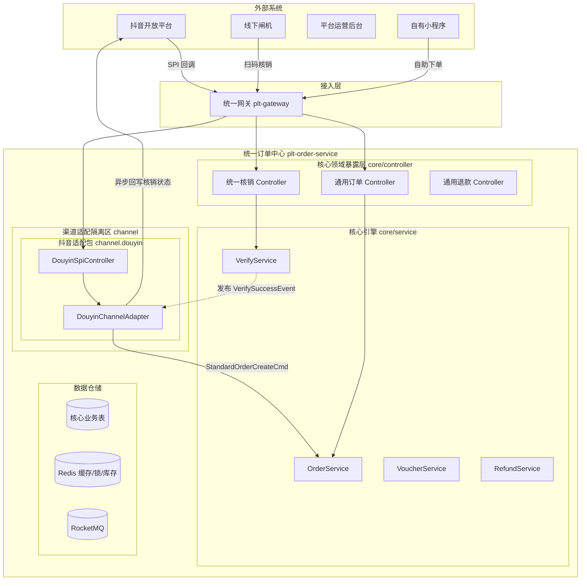
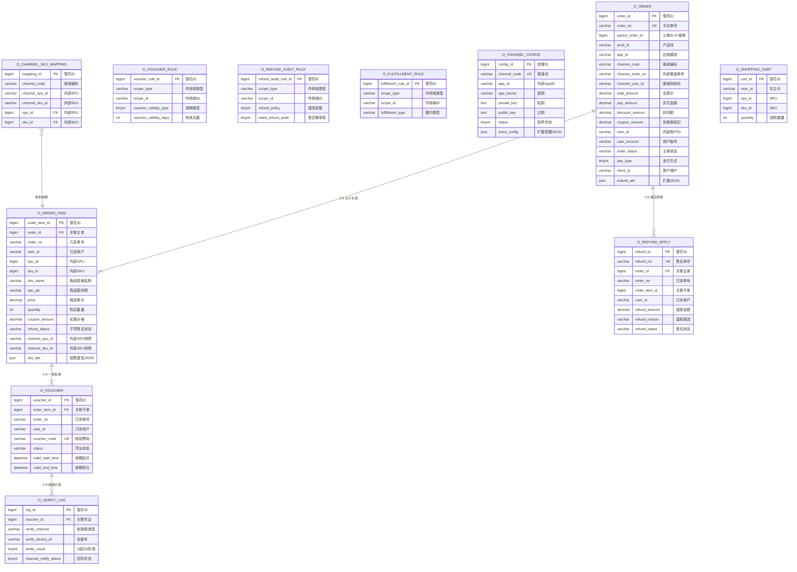
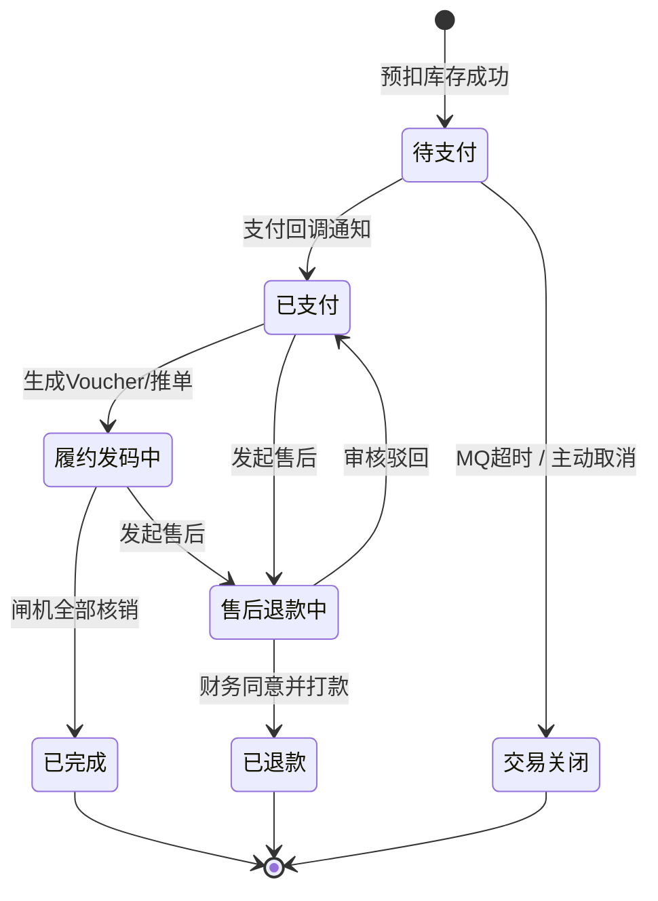
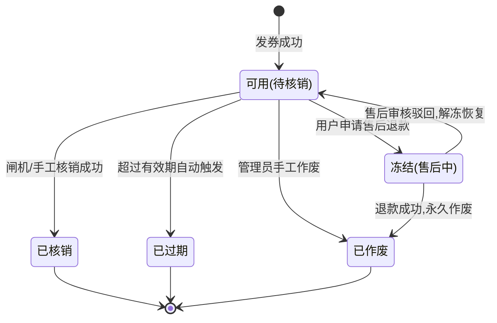
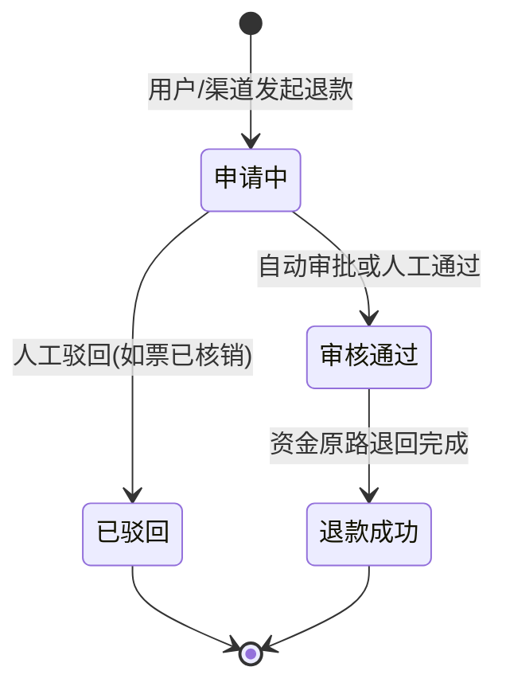

# 统一订单中心 — 最终技术设计全案 (FINAL V5.3)

> **文档定位**: 本文档是统一订单中心 (`plt-order-service`) 的**唯一权威设计纲领**，整合了从 V3.0 到 V5.3 所有阶段的讨论成果。  
> **更新日期**: 2026-03-26  
> **整合来源**: V3.0 架构解耦版、V3.1 SPU/SKU 与 API 设计、V3.2 电商化扩充、V3.3 状态机与中间件、V3.4 框架锁 Review、V4.0 终版纲领、V5.0~V5.3 数据库标准化。  
> **配套 SQL**: [unified_order_schema.sql (V5.3)](./unified_order_schema.sql)

---

## 一、 项目背景与架构目标

### 1.1 业务背景
为支持多渠道（抖音、美团、自有小程序等）的酒旅及生活服务券码业务，需构建一个**全渠道感知、业务逻辑解耦、强溯源**的统一订单中心。

### 1.2 核心目标
| 目标 | 说明 |
|------|------|
| **渠道无关性** | 内部核心逻辑（下单、核销、售后）不感知具体 OTA 渠道 |
| **高性能履约** | 基于电子凭证（Voucher）的高并发核销能力 |
| **合规与审计** | 全流程审计追踪，支持分片存储（Sharding Ready） |
| **扩展性** | 支持快速接入新渠道（策略模式、JSON 扩展配置） |

---

## 二、 架构核心理念与约束

### 2.1 三大设计约束

1.  **纯净的底座 (Core)**：业务核心层（订单、商品规则、退款、核销）**严禁**包含任何渠道专有字段（如 `douyin_app_id`、`ota_status`）。
2.  **防腐适配器 (Channel)**：系统外部的流量（如抖音的 SPI 调用、美团的回调）必须在独立的 `channel` 包下被消化、验签，并转换为标准的 `StandardOrderCreateCmd` 等内部指令后，才能交给底层服务。
3.  **响应式解耦 (Event-Driven)**：当核心层发生状态扭转（如线下闸机验票成功），底层不主动调用外网，而是发布 Spring 领域事件（如 `VerifySuccessEvent`）；对应的渠道适配器使用 `@EventListener` 监听后自行异步完成向外的网络回写。

### 2.2 单向依赖红线 (严禁越栈调用)

> **核心不依赖渠道 (Core 🚫 Channel)**，渠道单向依赖核心 (Channel → Core)，反向通信仅靠事件 (Event-Driven)。

```text
cn.com.bsszxc.plt.order
├── api                     # RPC Feign 客户端与外部公用的 POJO/DTO
├── db                      # 通用表 Entity、Mapper
├── service                 # 顶层服务：OrderService, VoucherService, VerifyService, RefundService
├── event                   # 领域标准事件定义：VerifySuccessEvent, OrderPaidEvent
├── controller              # 供内部微服务、自有小程序、后台、闸机直连的标准 API
└── channel                 # 【包含各渠道特色的防腐隔离区】
    ├── api                 # 渠道适配器标准接口 (如 ChannelAdapter)
    └── douyin              # 抖音专属适配实现 (可随时拔插)
        ├── dto             # 专属于抖音的各种 API 入参出参
        ├── strategy        # 抖音复杂场景策略路由 (GroupBuyStrategy, CalendarStrategy)
        ├── spi             # 暴露给抖音公网的 SPI 回调接口 (/spi/douyin/*)
        └── adapter         # DouyinChannelAdapter (签名、组装、监听事件)
```

### 2.3 系统拓扑图



### 拓扑图核心流转说明 🔄
1. **下单与发码阶段**：抖音通过 SPI 接口调用网关 `GW`，路由至独立的 `DouyinSpiController`。适配器 `DY_Ada` 完成验签、请求转换、及商品映射关系核对后，将纯净的“通用下单发卷模型”下发给底层的 `OrderService` 及 `VoucherService` 执行入库。
2. **正向核销阶段**：无论凭证来自自有小程序还是抖音，线下闸机 `Gate` 永远只认通用的验票接口 `OrderCtrl`。系统纯粹在本地 DB/Redis 验证票据合法性。
3. **事件反向同步阶段**：验票成功并落库后，底层通过 Spring 发布进程内的“核销成功事件”。抖音适配器 `DY_Ada` 监听到属于自己渠道的票被核销了，由它再去组装抖音特定的请求向外发射（履约回写）。闸机丝毫不受外网卡顿的影响。
4. **外部退款核查阶段**：客诉退款先发生在外部渠道。抖音向外下发退款审核，经适配层到达底层的 `RefundService`，底层判断票据是否已被核销以决定是否同意该退单请求。

---

## 三、 业务建模 (Domain Modeling)

### 3.1 SPU / SKU 商品模型

| 概念 | 说明 | 举例 |
|------|------|------|
| **SPU** | 标准产品单元，代表一个产品主体 | "欢乐谷门票" |
| **SKU** | 最小售卖规格单元 | "欢乐谷成人周末票"、"欢乐谷儿童工作日票" |

**在架构中的体现**：
-   订单明细表中必须精确记录到 `sku_id`，确保库存扣减和财务对账的精确性。
-   渠道映射表 `o_channel_sku_mapping` 将抖音的外部商品 ID 映射到内部的 `spu_id` + `sku_id`。

### 3.2 SPU/SKU 映射与快照的双重机制

| 机制 | 表 | 职责 |
|------|------|------|
| **映射（字典）** | `o_channel_sku_mapping` | 仅用于下单时的 ID 转换，将外部渠道商品 ID 解析为内部 SPU/SKU |
| **快照（核心）** | `o_order_item` | 冗余 `channel_spu_id`, `channel_sku_id`, `spu_pic`，确保订单一旦生成即与配置解耦 |

> **核心价值**：映射变更不影响历史订单的审计与对账。

### 3.3 订单三级结构

```
主订单 (Order)         → 支付总括、用户身份、整体状态
  └── 子订单项 (OrderItem) → 具体商品、单价、快照、独立售后状态
        └── 履约凭证 (Voucher) → 具体票码、效期、独立核销
```

**为什么需要子订单？**
游客极大概率会购买"家庭游组合套餐"（即1笔钱买出2张成人票、1张儿童票的不同 SKU）。单表结构无法支撑部分退款、分票种统计等需求。

### 3.4 拆单与合单

| 场景 | 实现方式 |
|------|------|
| **拆单** | 用户买了门票+实体商品，支付成功后触发拆单路由。原订单作为父单，新生成子订单（`parent_order_id` 指向父单）。`parent_order_id = 0` 代表根主单。 |
| **合单支付** | 购物车合并结算，生成一个总流水支付单关联多个业务订单，一次支付回调解冻多个订单状态。 |

> **为什么 `parent_order_id` 用 `0` 而非 `NULL`？**
> 1. **索引友好**：`IS NULL` 在某些 MySQL 版本下导致索引失效，`= 0` 稳定走索引。
> 2. **代码防雷**：判断 `== 0L` 比 `!= null` 更明确，不易引发 NPE。

---

## 四、 数据库全景设计 (V5.3)

### 4.1 ER 关系图



### 4.2 关键底层规范

| 规范 | 说明                                                                                                                                |
|------|-----------------------------------------------------------------------------------------------------------------------------------|
| **审计字段统一** | 各业务表统一包含 `tenant_id`, `create_user`, `modify_user`, `create_time`, `modify_time`, `deleted`（规则表额外使用 `scope_type + scope_id` 描述作用域） |
| **水平扩展支持** | `o_order_item`, `o_voucher`, `o_refund_apply` 全部冗余 `user_id` 和 `order_no`，支持按用户分片                                                 |
| **全域用户追踪** | `o_order.channel_user_id` 保存外部渠道用户身份（如 OpenID），支持 OneID 用户画像                                                                      |
| **凭证效期天花板** | 长期有效的电子凭证，`valid_end_time` 统一存 `2099-12-31 23:59:59`                                                                              |
| **ID 策略** | 除 `o_channel_config` 使用 `AUTO_INCREMENT` 外，其余全部使用雪花算法 (`ASSIGN_ID`)                                                               |

### 4.3 核心实体类清单 (9 个)

所有实体均继承 `TenantSuperModel`，审计字段使用 `@TableField(fill = FieldFill.INSERT)` / `INSERT_UPDATE` 自动填充。

| Java 类 | 数据库表 | 说明 |
|---------|---------|------|
| `Order` | `o_order` | 订单主表 |
| `OrderItem` | `o_order_item` | 子订单明细 |
| `Voucher` | `o_voucher` | 履约凭证 |
| `VerifyLog` | `o_verify_log` | 核销流水 |
| `RefundApply` | `o_refund_apply` | 逆向售后 |
| `VoucherRule` | `o_voucher_rule` | 码券规则 |
| `RefundAuditRule` | `o_refund_audit_rule` | 退款审核规则 |
| `FulfillmentRule` | `o_fulfillment_rule` | 履约规则 |
| `ChannelConfig` | `o_channel_config` | 渠道密钥配置 |
| `ChannelSkuMapping` | `o_channel_sku_mapping` | 渠道SKU映射 |
| `ShoppingCart` | `o_shopping_cart` | 购物车暂存 |

---

## 五、 订单状态机 (!核心逻辑)

### 5.1 状态流转图



### 5.2 单向性铁律（为什么不能回退到 CANCELED？）

> **一旦订单跨越了 `PAID` 红线（产生了资金流动），绝不能简单回退到 `CANCELED`，必须走 `REFUNDING → REFUNDED` 的逆向售后路径。**

**原因**：
-   `CANCELED` = 未发生任何资金纠葛，随时可以销毁。
-   `REFUNDED` = 产生了实际的财务冲正记录。
-   如果将已付款的退单也标为 `CANCELED`，月末对账时**无法区分"未付款取消"和"已付款退款"**，导致财务对账崩溃。

### 5.3 核销端 vs 订单来源的区别

`verify_channel`（核销端类型）≠ `channel_code`（订单来源渠道），必须严格区分：

| verify_channel 值 | 含义 |
|-------------------|------|
| `GATE` | 线下物理闸机扫码 |
| `MINIAPP_SELF` | 小程序端自助核销 |
| `ADMIN_MANUAL` | 运营后台手工核销 |
| `DISTRIBUTOR_API` | 分销商 API 直连核销 |

> **关键**：一张**抖音渠道**买的票，游客拿去**闸机**扫码，核销记录的 `verify_channel = GATE`，而非 `DOUYIN`。是否需要 SPI 回调，由主订单的 `channel_code` 决定。

### 5.4 凭证状态枚举 (Voucher Status)

`o_voucher.status` 字段控制每一张票码的独立生命周期：



| 状态值 | 含义 | 触发条件 |
|--------|------|----------|
| `USABLE` | 可用，待核销 | 发券成功（`VoucherService.issueVoucher`） |
| `VERIFIED` | 已核销 | 闸机/手工核销成功 |
| `EXPIRED` | 已过期 | 超过 `valid_end_time`（定时任务或懒检查） |
| `LOCKED` | 冻结中 | 用户申请售后退款，凭证暂停使用 |
| `INVALID` | 已作废 | 退款成功后永久作废 / 管理员手工作废 |

> **注意**：已核销（`VERIFIED`）的凭证不允许发起退款，这是保护商户利益的核心防线。

### 5.5 售后状态枚举 (Refund Status)

`o_refund_apply.refund_status` 字段控制每一笔退款申请的流转：



| 状态值 | 含义 | 触发条件 |
|--------|------|----------|
| `APPLYING` | 申请中 | 用户/渠道发起退款，对应凭证切为 `LOCKED` |
| `APPROVED` | 审核通过 | 根据 `o_refund_audit_rule.refund_policy` 自动审批或人工通过 |
| `SUCCESS` | 退款成功 | 资金原路退回完成，凭证切为 `INVALID` |
| `REJECTED` | 已驳回 | 票已核销等原因被拒，凭证解冻恢复为 `USABLE` |

> **联动规则**：
> - 退款申请创建时 → 对应 `o_voucher.status` 切为 `LOCKED`。
> - 退款成功时 → `o_voucher.status` 切为 `INVALID`，`o_order.order_status` 视情况切为 `REFUNDED` 或保持 `DELIVERING`（部分退）。
> - 退款驳回时 → `o_voucher.status` 恢复为 `USABLE`。

### 5.6 渠道回写状态枚举 (Channel Notify Status)

`o_verify_log.channel_notify_status` 字段控制核销后对外部渠道的异步通知：

| 状态值 | 含义 | 说明 |
|--------|------|------|
| `0` | 无需回写 | 自有小程序等内部渠道订单，无需通知外部 |
| `1` | 待回写 | 核销成功，等待异步事件触发回写 |
| `2` | 已回写 | 外部渠道确认收到核销通知 |
| `3` | 回写失败 | 通知失败，进入重试队列 |

> **赋值逻辑**：自有小程序来源的订单，核销记录直接赋 `0`，脱离回写机制；OTA 渠道来源的订单赋 `1`，由事件监听器异步处理。

---

## 六、 高可用机制与并发防线

### 6.1 防超卖：@DistributedLock + Redisson

**方案一（默认推荐）：基于 RLock 的分布式悲观锁排队**
```java
@DistributedLock(keyPrefix = "ORDER_STOCK:", lockKey = "#cmd.skuId")
public OrderResult createOrder(StandardOrderCreateCmd cmd) {
    // 查库存 → 扣减 → 创单，全程串行化
}
```

**方案二（秒杀活动）：基于 RSemaphore 的非阻塞信号量**
-   将 SKU 可用库存预热到 Redisson 的 `RSemaphore`。
-   用户下单时直接 `semaphore.tryAcquire()`，拿不到即秒级拒绝。
-   底层自动封装 Lua 脚本，天然原子性，非阻塞超高并发。

> **⚠️ 框架漏洞预警**：`DistributedLockAspect` 的 `finally` 块中必须增加 `lock.isHeldByCurrentThread()` 校验，防止 Full GC 导致的锁虚释放引发 `IllegalMonitorStateException`。

```diff
  } finally {
-     if (lockFlag) {
+     if (lockFlag && lock.isHeldByCurrentThread()) {
          lock.unlock();
      }
  }
```

### 6.2 防刷：Redis + Lua

-   **网关层**：基于 `IP + User ID` 做漏桶/令牌桶限流（同一账号 1 分钟限 5 次）。
-   **业务层**：SPI 回调使用 `RequestId` 在 Redis 做 `setnx` 防重放。

### 6.3 超时关单：RocketMQ 延迟消息

**严禁采用数据库定时任务扫描。**

1.  创单 `PENDING` 成功后，向 RocketMQ 发送 15 分钟延迟消息。
    -   RocketMQ 4.x：`message.setDelayTimeLevel(xx)` 预设档位。
    -   RocketMQ 5.x：`message.setDeliverTimeMs(System.currentTimeMillis() + 15 * 60 * 1000)`。
2.  消费者收到消息后查询订单状态，若仍为 `PENDING`，执行关单并释放库存。

---

## 七、 渠道防腐与策略模式 (以抖音为例)

### 7.1 抖音 SPI 四段式流转

| 阶段 | 抖音 SPI | 内部服务调用 | 说明 |
|------|----------|------------|------|
| 1. 预订校验 | `/validateOrder` | `ProductRuleService.checkStock()` | 仅查库存，不创单 |
| 2. 创建订单 | `/createOrder` | `OrderService.create()` | 落库主子订单，`PENDING` 状态 |
| 3. 确认订单 | `/confirmOrder` | 更新状态为 `PAID` | 可选阶段 |
| 4. 发券 | `/issueVoucher` | `VoucherService.issueVoucher()` | 生成票码，加密返回抖音 |

### 7.2 策略模式隔离抖音多业务形态

抖音存在多种业务线（团购券、日历票等），且**报文结构完全不同**。在适配器内部使用策略模式彻底隔离复杂度：

```text
DouyinSpiController
  ↓ 提取 biz_type
DouyinBizStrategyFactory
  ├── DouyinGroupBuyStrategy      (团购券: 核销后发券)
  └── DouyinCalendarTicketStrategy (日历票: 强日期约束、选座锁定)
  ↓ 统一输出
StandardOrderCreateCmd → Core OrderService
```

> **核心价值**：不论抖音有多少种变形模式，经适配器消化后向下扔给 Core 层的都是极简的标准指令，核心领域层无需感知渠道差异。

### 7.3 事件驱动的反向状态同步

```
VerifyService (核销成功)
  ↓ 发布 Spring Domain Event
VerifySuccessEvent
  ↓ @EventListener
DouyinChannelAdapter
  ↓ 检查 channel_code == "DOUYIN"
  ↓ 组装回写报文
抖音开放平台 (异步回写核销通知)
  ↓ 更新 o_verify_log.channel_notify_status
```

> **架构收益**：闸机核销走本地 DB/Redis 修改后直接开门（<300ms），不受外网抖动影响。回写动作靠异步事件触发，故障完全物理降级。

### 7.4 退款校验流

1.  抖音 SPI 通知退款审核 → `DouyinSpiController` → `DouyinChannelAdapter`。
2.  适配器取出请求后下发给核心层 `RefundService`。
3.  核心层读取 `o_refund_audit_rule.refund_policy`，检查 `o_voucher` 状态：
    -   **票未核销** → 冻结凭证（`LOCKED`），返回"同意退款"。资金退款由渠道执行。
    -   **票已核销** → 拒绝退款，保护商户利益。

---

## 八、 统一订单中心标准 API 资产清单

以下 API 由 `core/controller` 暴露，**不包含渠道 SPI 接口**：

### 8.1 交易与订单组
| 接口 | 方法 | 说明 |
|------|------|------|
| `/api/core/order/create` | POST | 统一下单（SPU/SKU + 购买人信息） |
| `/api/core/order/cancel` | POST | 取消未支付订单，释放库存 |
| `/api/core/order/detail/{order_no}` | GET | 查询订单详情（含 Voucher） |
| `/api/core/order/page` | POST | 多维条件分页查询 |
| `/api/core/order/pay-callback` | POST | 支付服务异步通知 |
| `/api/core/order/calc-price` | POST | 生单前价格计算器（不落库） |

### 8.2 票务与凭证组
| 接口 | 方法 | 说明 |
|------|------|------|
| `/api/core/voucher/query` | GET | 根据票码查询凭证状态 |
| `/api/core/voucher/disable` | POST | 手工冻结/作废凭证 |
| `/api/core/voucher/delay` | POST | 凭证延期 |

### 8.3 统一核销引擎组
| 接口 | 方法 | 说明 |
|------|------|------|
| `/api/core/verify/check` | POST | 核心核销口（闸机、扫码枪唯一接口） |
| `/api/core/verify/manual` | POST | 票务中心人工手工核销 |

### 8.4 售后与退款组
| 接口 | 方法 | 说明 |
|------|------|------|
| `/api/core/refund/apply` | POST | 发起退票申请 |
| `/api/core/refund/audit` | POST | 人工审批退款单 |
| `/api/core/refund/detail` | GET | 退款链路查询 |

### 8.5 购物车组（预留）
| 接口 | 方法 | 说明 |
|------|------|------|
| `/api/core/cart/add` | POST | 加入购物车 |

---

## 九、 实施路线图 (Roadmap)

| Phase | 内容 | 状态 |
|-------|------|------|
| **Phase 1** | 基建与模型：V5.3 表结构 + 9 大实体类 | ✅ 已完成 |
| **Phase 2** | 核心组件：Mapper/Service骨架 + OrderStateMachine | 🔜 待开发 |
| **Phase 3** | 主流程：内部下单 → 支付回馈 → 凭证生成 | ⏳ 规划中 |
| **Phase 4** | 渠道集成：抖音 SPI 适配器实现 | ⏳ 规划中 |
| **Phase 5** | 逆向与核销：售后审批 + 核销 API + 回写 | ⏳ 规划中 |
