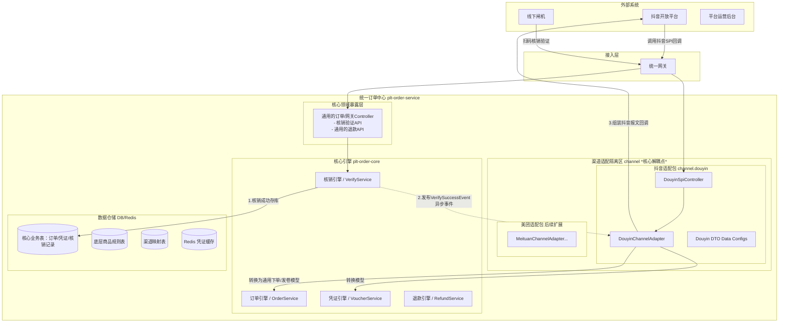

# 统一订单中心 — 详细技术设计文档 (v3.0 架构解耦版)

> **版本**: v3.0  
> **创建日期**: 2026-03-24  
> **核心目标**: 建设真正的“全渠道统一订单中心”，同时向下兼容抖音等 OTA SPI 接口。  
> **首期 MVP**: 抖音本地生活（团购券）的商品映射、下单、发券、核销与退款闭环。

---

## 1. 架构核心理念 💡

之前架构中最大的问题是**渠道细节向核心领域泄漏**。V3.0 架构最重要的约束是：**领域解耦**。

1. **绝对纯粹的底层（Core）**：核心的订单、凭证、核销、退款表和逻辑里，**不允许出现任何特定 OTA（抖音、美团）相关的字段**（如 `ota_notify_status`、`voucher_validity_type` 等不应存在的渠道映射字段）。
2. **插件化的渠道层（Channel）**：所有抖音相关的 SPI 接口请求、特有 DTO（如 `DouyinCreateOrderRequest`）、抖音签名机制等，全部强制隔离在特定的 Channel 适配器包中。
3. **事件驱动的回调（Event-Driven）**：当系统发生核销、退款时，核心层只修改内部状态并发出标准化的**领域事件（Domain Event）**，不主动去调用特定渠道的网络接口。相关的渠道适配器通过监听这些事件，再去触发对抖音网络接口的回写。

---

## 2. 系统拓扑与模块划分



### 拓扑图核心流转说明 🔄
1. **下单与发码阶段**：抖音通过 SPI 接口调用网关 `GW`，路由至独立的 `DouyinSpiController`。适配器 `DY_Ada` 完成验签、请求转换、及商品映射关系核对后，将纯净的“通用下单发卷模型”下发给底层的 `OrderService` 及 `VoucherService` 执行入库。
2. **正向核销阶段**：无论凭证来自自有小程序还是抖音，线下闸机 `Gate` 永远只认通用的验票接口 `OrderCtrl`。系统纯粹在本地 DB/Redis 验证票据合法性。
3. **事件反向同步阶段**：验票成功并落库后，底层通过 Spring 发布进程内的“核销成功事件”。抖音适配器 `DY_Ada` 监听到属于自己渠道的票被核销了，由它再去组装抖音特定的请求向外发射（履约回写）。闸机丝毫不受外网卡顿的影响。
4. **外部退款核查阶段**：客诉退款先发生在外部渠道。抖音向外下发退款审核，经适配层到达底层的 `RefundService`，底层判断票据是否已被核销以决定是否同意该退单请求。

### 推荐的包结构与依赖倒置原则 (严禁越栈调用)

```text
cn.com.bsszxc.plt.order
├── api                 # 跨微服务调用的 Feign Client 及 POJO 
├── core                # 核心底层实现
│   ├── db              # Entity、Mapper （通用的表）
│   ├── service         # OrderService, VerifyService等
│   ├── event           # Domain Events (如 VerifySuccessEvent)
│   └── controller      # 闸机、管理后台用的通用 Controller
├── channel             # 渠道层隔离区
│   ├── api             # 标准的 ChannelAdapter 接口、ChannelConfig等
│   └── douyin          # [MVP]抖音专属实现
│       ├── dto         # DouyinCreateOrderRequest, DouyinCancelOrderRequest 等
│       ├── controller  # 仅暴露给抖音服务器调用的 SPI Endpoint
│       └── adapter     # 组装抖音加解密、签名、转换为通用Order模型
```

#### 🛡️ 什么是“严禁越栈调用”？
为了保证核心订单系统不随着未来数十个渠道的接入而“腐化”，开发时必须遵守以下绝对的**单向依赖红线**：
1. **核心不依赖渠道（Core 🚫 Channel）**：`core` 包下的任何文件（包含 Entity、Service 甚至是 Controller），**绝对不允许 `import`** `cn.com.bsszxc.plt.order.channel.*` 下的任何类（如 `DouyinCreateOrderRequest`）。
2. **渠道单向依赖核心（Channel ➡️ Core）**：`channel` 包下的代码作为特定的“适配器插件”，可以完全自由地 `import` 和调用 `core` 层暴露的 Service 和领域模型，以此去完成通用的下单、发码操作。
3. **反向通信仅靠事件（Event-Driven）**：如果核心底层（如 `VerifyService`）发生了状态的改变，并且渠道层必须知道这一改变（如核销验票成功要触发抖音接口通知），**核心层不得去调用渠道层的工具类**，而是抛出一尘不染的 `VerifySuccessEvent` 领域事件；具体的渠道层则通过 Spring 的 `@EventListener` 进行无侵入式的订阅捕获，随后自行拼装网络包向外发射。

---

## 3. 核心数据模型重构方案 🗄️

抛弃所有在通用订单表中塞入 `ota` 关键字的做法，表结构做如下调优：

### 3.1 完全去渠道化的核心业务表（`o_`开头）

#### 一、订单主表 (`o_order`)
彻底删去 `product_mapping_id` 和 `channel_product_id`。如果需要通过订单反查映射参数，记录在 `extra_data` 中即可。
```sql
CREATE TABLE `o_order` (
  `id` bigint unsigned NOT NULL AUTO_INCREMENT,
  `order_no` varchar(64) NOT NULL COMMENT '平台统一订单号',
  `channel_code` varchar(32) NOT NULL COMMENT '渠道编码(如: DOUYIN, WECHAT_MINI)',
  `channel_order_no` varchar(128) DEFAULT NULL COMMENT '网关/外渠侧的订单号',
  `platform_product_id` bigint NOT NULL COMMENT '平台商户配置的内部商品ID',
  `product_name` varchar(256) DEFAULT NULL COMMENT '系统内部商品名称',
  `total_quantity` int NOT NULL DEFAULT '1' COMMENT '订单总票数',
  `verified_quantity` int NOT NULL DEFAULT '0' COMMENT '已核销票数',
  `refunded_quantity` int NOT NULL DEFAULT '0' COMMENT '已退款票数',
  `total_amount` decimal(10,2) DEFAULT NULL COMMENT '订单总额',
  `order_status` tinyint NOT NULL DEFAULT '0' COMMENT '状态: 0待确认 1已确认 2待核销 3部分核销 4已核销...',
  `extra_data` json DEFAULT NULL COMMENT 'JSON: 存放渠道扩展(包括渠道商品ID等)',
  `create_time` datetime DEFAULT CURRENT_TIMESTAMP,
  -- 其它审计字段（tenant_id、deleted...）略
  PRIMARY KEY (`id`),
  UNIQUE KEY `uk_order_no` (`order_no`)
) COMMENT='平台统一订单主表';
```

#### 二、核销记录表 (`o_verify_log`)
将针对 OTA 的 `ota_notify_status` 泛化为与渠道解耦的 `channel_notify_status`。
```sql
CREATE TABLE `o_verify_log` (
  `id` bigint unsigned NOT NULL AUTO_INCREMENT,
  `voucher_id` bigint NOT NULL,
  `voucher_code` varchar(64) NOT NULL,
  `order_id` bigint NOT NULL,
  `verify_result` tinyint NOT NULL COMMENT '核销结果：1-成功 0-失败',
  `verify_channel` varchar(32) NOT NULL COMMENT '核销端: GATE/MANUAL',
  `channel_notify_status` tinyint NOT NULL DEFAULT '0' COMMENT '外部渠道通知状态: 0-无需回写 1-待回写 2-已回写 3-回写失败',
  -- 其它审计字段（tenant_id、deleted...）略
  PRIMARY KEY (`id`)
) COMMENT='统一核销记录表';
```
> **提示**: 小程序来源的订单落核销记录时，直接赋为 `0-无需回写` 即可脱离该机制流转。

#### 三、 凭证表 (`o_voucher`) 与 退款表 (`o_refund`)
设计与其他表相似，仅仅记录该表领域自身的核心字段：`status`、`valid_start_time`、`valid_end_time`（凭证）；`refund_reason`、`refund_amount`（退款）。不掺入任何业务规则（如退票率、核销政策）。

---

### 3.2 下沉的核心产品规则表

由于之前把“票有效期”、“退票策略”做在渠道映射里是非常致命的设计（非抖音渠道将拿不到这些规则）。我们需要建立一个**通用产品规则表快照**，或在单体内提供独立的产品规则服务表：

```sql
CREATE TABLE `o_product_rule` (
  `id` bigint unsigned NOT NULL AUTO_INCREMENT,
  `platform_product_id` bigint NOT NULL,
  `voucher_validity_type` tinyint NOT NULL DEFAULT '1' COMMENT '凭证有效期类型：1-当日有效 2-指定日期 3-N日内有效',
  `voucher_validity_days` int DEFAULT NULL COMMENT '有效天数',
  `refund_policy` tinyint NOT NULL DEFAULT '1' COMMENT '退款策略：1-自动审批 2-人工审核',
  -- 其它审计字段（tenant_id、deleted...）略
  PRIMARY KEY (`id`),
  UNIQUE KEY `uk_product_id` (`platform_product_id`)
) COMMENT='通用商品业务规则表';
```

---

### 3.3 渠道关联与适配表 (`o_channel_`)

用来解决抖音、美团等第三方需要“商品关联与验签字典”的问题。该部分只向 `cn.com.bsszxc.plt.order.channel.*` 下游适配器提供支撑：

1. `o_channel_config`: 通用渠道参数表，存放不同渠道的 `app_id`、`app_secret`。
2. `o_channel_product_mapping`:
```sql
CREATE TABLE `o_channel_product_mapping` (
  `id` bigint unsigned NOT NULL AUTO_INCREMENT,
  `channel_code` varchar(32) NOT NULL COMMENT '渠道编码,如DOUYIN',
  `platform_product_id` bigint NOT NULL COMMENT '对应核心系统内的商品ID',
  `channel_product_id` varchar(128) NOT NULL COMMENT '渠道侧长串商品ID或三方商品ID',
  `status` tinyint NOT NULL DEFAULT '1',
  -- 其它审计字段（tenant_id、deleted...）略
  PRIMARY KEY (`id`),
  KEY `idx_chan_prod` (`channel_code`, `channel_product_id`)
) COMMENT='渠道商品关系映射表';
```

---

## 4. MVP首期核心实施流转（抖音团购OTA场景）

抖音作为外部生态的调用中枢，核心有三种流转，以下展示全新解耦架构下的处理：

### 场景 1：抖音端发起的下单发码请求（SPI Callback ➡️ Platform）
抖音用户支付成功后，抖音向我们发起 SPI 请求派发凭证。
1. `DouyinSpiController` 接收入参（脱敏、验签），得到 `DouyinCreateOrderRequest`。
2. `DouyinChannelAdapter` 被唤醒：
   - 根据入参的 `douyin_product_id` 查阅 `o_channel_product_mapping` 获得内部正规的 `platform_product_id`。
   - 读取内部 `o_product_rule` 校验下单约束。
   - 组装一个**标准的业务内网层 DTO：`StandardOrderCreateCmd`**，向下透传给核心域。
3. `OrderService` 接收到 `StandardOrderCreateCmd`，纯净地保存一条 `o_order`。
4. `VoucherService` 生成基于我们平台全局唯一约束的凭证码串。
5. Adapter 将内网 Voucher 的凭证封装回 `DouyinCreateOrderResponse`，加密签名由于 SPI 输出。

### 场景 2：线下闸机端发起的正向核销请求（Gate ➡️ Platform）
游客到达线下刷码验票。
1. Gate调用 `CheckController`（通用，无需知道用户是以怎么下单的）。
2. Core 内置的 `VerifyService` 对二维码合法查验。
3. 如果验签通过：修改 `o_voucher` (未使用->已使用)，在 `o_verify_log` 里写明（该用户核销成功）。
4. （关键）**代码通过 Spring Context 发布一个 `VoucherVerifySuccessEvent` 事件。请求直接返回闸机，闸机开门。响应时间保证在极其迅速的 <300ms**。

### 场景 3：事件驱动的反向状态履约同步（Platform Asynchronously ➡️ Douyin）
承接上方场景。
1. `DouyinChannelAdapter` 实现了 `@EventListener(VoucherVerifySuccessEvent.class)`。
2. 当捕捉到有券被核销时，检查其来源 `channel_code == "DOUYIN"`。
3. 生成向抖音官方域名发送核销通知（履约验券、回写状态等网络发包）的指令。
4. 失败则进行网络层重试，如果最终完成通知，回调更正 `o_verify_log` 中的 `channel_notify_status = 2（已回写）`，形成最终闭环。

### 场景 4：外部发起的退款校验与作废（Douyin ➡️ Platform）
1. 游客在抖音客户端发起申请退款，抖音通过 SPI 向我们的平台下发退款审核（`applyRefund`）。
2. `DouyinSpiController` 获取入参，适配器 `DouyinChannelAdapter` 取出 `DouyinRefundApplyRequest`。
3. 向底层核心层 `RefundService` 下发“尝试发起退单作废指令”。
4. 底层服务依据通用退单策略（读取该订单对应的 `o_product_rule.refund_policy`），以及核查 `o_voucher` 的状态：
   - 票尚未验证：冻结此凭证（标记状态为已失效），并且向上一路抛出“同意退款”标示回到抖音 SPI 返回。资金退款由抖音执行。
   - 票已然被闸机刷掉：抛出 `BusinessException` 或阻断标示，适配层包装为“拒退”响应告知抖音，保护商户利益。

---

## 5. 新旧方案直观对比与总结

| 对比维度 | 原有架构产生的麻烦 | 解耦后新架构的收益 |
|---------|---------|---------|
| **接入新端(如自主小程序)** | 小程序下单必须凭空制造一个伪造的“渠道关联映射ID”来让 `o_order`入库，且无法配置独立的有效期。 | 小程序直接传 `platform_product_id` 调 Core 接口下单即可，无需任何伪造。 |
| **退款及有效期规则** | 放错在 OTA 外联表中。如果1个商品上架3个渠道，需配置三遍规则且极易发生不一致。 | 统一上浮提取到 `o_product_rule` 内部配置，全网一处配置生效。 |
| **SPI与核销的响应延迟** | 闸机核销接口耦合了调用并等待抖音平台网络回写响应。一旦抖音限流掉线，现场闸机也因此直接卡死不开门。| 采用事件驱动监听，闸机核销走本地 Redis/DB 修改后直接开门。回写动作靠异步事件触发，故障完全物理降解。 |
