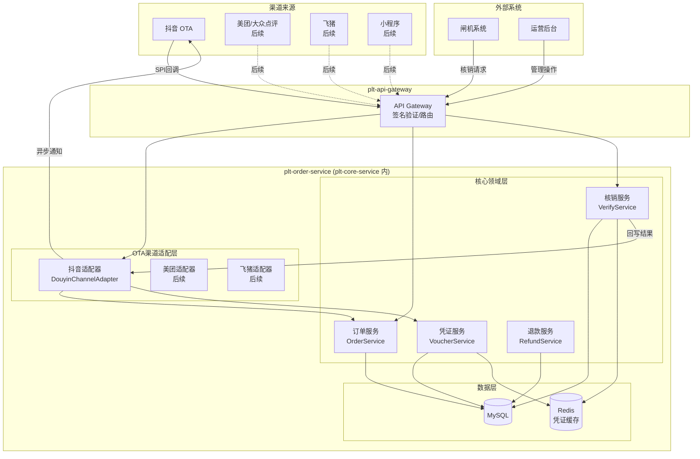
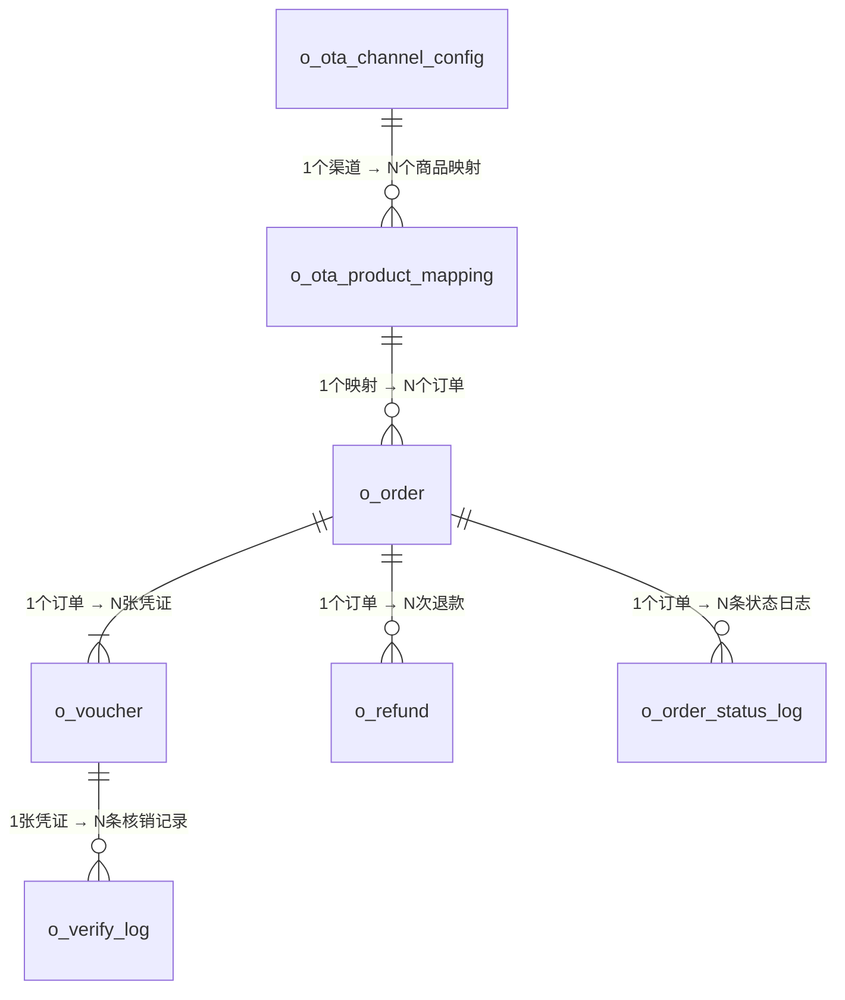
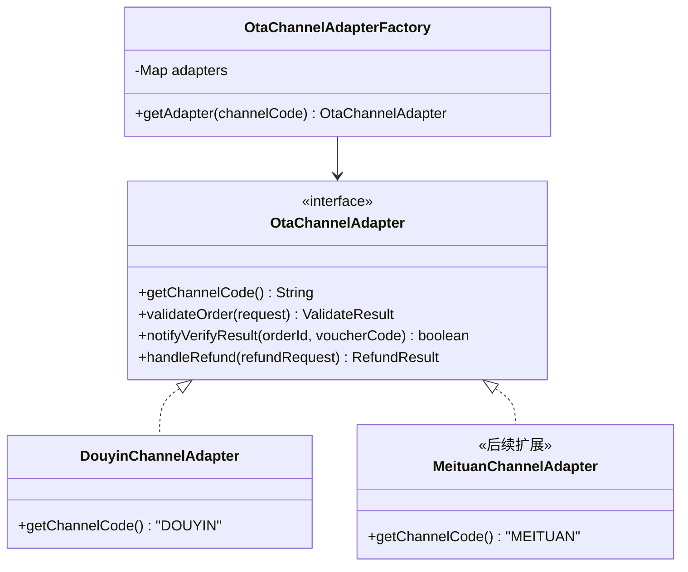

# 统一订单中心 — 技术设计文档

> **版本**: v2.0  
> **创建日期**: 2026-03-19  
> **最后更新**: 2026-03-19（重构为统一订单中心 + 整合票付通 V2 设计亮点）  
> **关联需求**: [OTA_BUSINESS_REQUIREMENTS.md](file:///d:/08-Work/01-博思/10-平台2.0/.agent/requirements/ota/OTA_BUSINESS_REQUIREMENTS.md)  
> **参考文档**: 票付通上游通用接口 V1/V2、抖音 OTA SPI 文档

---

## 1. 整体架构

### 1.1 设计理念

将原 `plt-ota-service` 提升为 **`plt-order-service`（统一订单中心）**。核心逻辑（订单、凭证、核销、退款）与渠道无关，OTA 仅作为订单来源渠道之一，后续小程序等新渠道可直接复用。

### 1.2 系统架构图



### 1.3 与支付服务的职责边界

| 服务 | 管什么 | 不管什么 |
|------|--------|----------|
| **plt-order-service（订单中心）** | 订单生命周期、凭证、核销、退款审核、OTA 渠道适配 | 资金流转、支付通道 |
| **plt-pay-service（支付中心）** | 支付、退款资金、分账、对账 | 业务订单状态、凭证 |

### 1.4 分层职责

| 层级 | 职责 | 关键设计 |
|------|------|----------|
| **OTA 渠道适配层** | 将各 OTA 的差异化协议转为统一内部模型 | 策略模式，按渠道编码路由 |
| **核心领域层** | 订单、凭证、核销、退款（与渠道无关） | 任何渠道共用，闸机/人工仅对接此层 |
| **数据层** | 持久化 + 凭证缓存 | MyBatis-Plus + Redis |

---

## 2. 模块结构

### 2.1 Maven 模块

```
plt-core-service/
├── plt-order-service/                # 统一订单中心（父模块）
│   ├── pom.xml                       # packaging=pom
│   ├── plt-order-api/                # Feign API + POJO
│   │   ├── pom.xml
│   │   └── src/main/java/cn/com/bsszxc/plt/order/
│   │       ├── constant/
│   │       │   └── OrderConstant.java
│   │       └── module/
│   │           ├── order/                    # 订单 API + POJO
│   │           │   ├── OrderApi.java
│   │           │   └── pojo/
│   │           ├── voucher/                  # 凭证 API + POJO
│   │           │   ├── VoucherApi.java
│   │           │   └── pojo/
│   │           ├── verify/                   # 核销 API + POJO
│   │           │   ├── VerifyApi.java
│   │           │   └── pojo/
│   │           ├── refund/                   # 退款 API + POJO
│   │           │   ├── RefundApi.java
│   │           │   └── pojo/
│   │           └── ota/                      # OTA 相关 API + POJO
│   │               ├── OtaChannelConfigApi.java
│   │               ├── OtaProductMappingApi.java
│   │               └── pojo/
│   └── plt-order-core/               # 业务实现层
│       ├── pom.xml
│       └── src/main/java/cn/com/bsszxc/plt/order/
│           ├── db/
│           │   ├── model/                    # Entity 实体类
│           │   └── mapper/                   # Mapper 接口
│           ├── service/                      # 核心领域服务
│           │   └── impl/
│           ├── module/
│           │   ├── order/controller/         # 订单 Controller
│           │   ├── voucher/controller/       # 凭证 Controller
│           │   ├── verify/controller/        # 核销 Controller
│           │   ├── refund/controller/        # 退款 Controller
│           │   └── ota/controller/           # OTA 管理 Controller
│           └── adapter/                      # OTA 渠道适配器
│               ├── OtaChannelAdapter.java
│               ├── OtaChannelAdapterFactory.java
│               └── douyin/
│                   ├── DouyinChannelAdapter.java
│                   ├── DouyinSpiController.java
│                   └── dto/
```

### 2.2 包名规范

| 层级 | 包名 |
|------|------|
| 根包 | `cn.com.bsszxc.plt.order` |
| Entity | `cn.com.bsszxc.plt.order.db.model` |
| Mapper | `cn.com.bsszxc.plt.order.db.mapper` |
| Service | `cn.com.bsszxc.plt.order.service` |
| ServiceImpl | `cn.com.bsszxc.plt.order.service.impl` |
| 核心业务 API/POJO | `cn.com.bsszxc.plt.order.module.{order/voucher/verify/refund}` |
| OTA 管理 API/POJO | `cn.com.bsszxc.plt.order.module.ota` |
| OTA 适配器 | `cn.com.bsszxc.plt.order.channel` |
| 抖音适配器 | `cn.com.bsszxc.plt.order.channel.douyin` |

---

## 3. 数据库设计

### 3.1 表命名规范

遵循项目约定（支付中心用 `p_` 前缀），订单中心统一用 **`o_`** 前缀：

| 分类 | 前缀 | 说明 |
|------|------|------|
| **通用表**（所有渠道共用） | `o_` | 订单、凭证、核销、退款等核心业务表 |
| **OTA 专属表**（仅 OTA 渠道使用） | `o_ota_` | 渠道配置、商品映射等 OTA 特有表 |

### 3.2 ER 关系图



### 3.3 通用表（`o_` 前缀 — 所有渠道共用）

#### 3.3.1 订单表 `o_order`

```sql
CREATE TABLE `o_order` (
  `id` bigint unsigned NOT NULL AUTO_INCREMENT COMMENT '自增主键',
  `order_no` varchar(64) NOT NULL COMMENT '平台订单号',
  `channel_code` varchar(32) NOT NULL COMMENT '渠道编码（DOUYIN/MEITUAN/MINIAPP等）',
  `channel_order_no` varchar(128) DEFAULT NULL COMMENT '渠道侧订单号（OTA渠道有值，小程序渠道可为空）',
  `product_mapping_id` bigint DEFAULT NULL COMMENT 'OTA商品映射ID（OTA渠道有值）',
  `platform_product_id` bigint DEFAULT NULL COMMENT '平台商品ID',
  `channel_product_id` varchar(128) DEFAULT NULL COMMENT '渠道侧商品ID',
  `product_name` varchar(256) DEFAULT NULL COMMENT '商品名称',
  `total_quantity` int NOT NULL DEFAULT '1' COMMENT '总票数',
  `verified_quantity` int NOT NULL DEFAULT '0' COMMENT '已核销票数',
  `refunded_quantity` int NOT NULL DEFAULT '0' COMMENT '已退款票数',
  `total_amount` decimal(10,2) DEFAULT NULL COMMENT '订单总金额',
  `order_status` tinyint NOT NULL DEFAULT '0' COMMENT '订单状态：0-待确认 1-已确认 2-待核销 3-部分核销 4-已核销 5-退款中 6-已退款 7-部分退款 8-已完成 9-已取消 10-出票失败',
  `use_date` date DEFAULT NULL COMMENT '使用日期',
  `buyer_name` varchar(64) DEFAULT NULL COMMENT '购买人姓名',
  `buyer_phone` varchar(32) DEFAULT NULL COMMENT '购买人手机号',
  `buyer_id_card` varchar(32) DEFAULT NULL COMMENT '购买人身份证',
  `extra_data` json DEFAULT NULL COMMENT '扩展数据（渠道特有字段）',
  `tenant_id` bigint DEFAULT NULL COMMENT '租户ID',
  `create_time` datetime DEFAULT CURRENT_TIMESTAMP COMMENT '创建时间',
  `modify_time` datetime DEFAULT CURRENT_TIMESTAMP ON UPDATE CURRENT_TIMESTAMP COMMENT '更新时间',
  `deleted` tinyint NOT NULL DEFAULT '0' COMMENT '是否删除',
  PRIMARY KEY (`id`),
  UNIQUE KEY `uk_order_no` (`order_no`),
  UNIQUE KEY `uk_channel_order` (`channel_code`, `channel_order_no`, `deleted`),
  KEY `idx_status` (`order_status`),
  KEY `idx_use_date` (`use_date`)
) ENGINE=InnoDB DEFAULT CHARSET=utf8mb4 COMMENT='订单表';
```

#### 3.3.2 凭证表 `o_voucher`

```sql
CREATE TABLE `o_voucher` (
  `id` bigint unsigned NOT NULL AUTO_INCREMENT COMMENT '自增主键',
  `voucher_code` varchar(64) NOT NULL COMMENT '凭证码（全局唯一）',
  `order_id` bigint NOT NULL COMMENT '关联订单ID',
  `order_no` varchar(64) NOT NULL COMMENT '关联订单号',
  `channel_code` varchar(32) NOT NULL COMMENT '渠道编码',
  `voucher_status` tinyint NOT NULL DEFAULT '0' COMMENT '凭证状态：0-待使用 1-已使用 2-已失效 3-已退款',
  `valid_start_time` datetime DEFAULT NULL COMMENT '有效期开始时间',
  `valid_end_time` datetime DEFAULT NULL COMMENT '有效期结束时间',
  `holder_name` varchar(64) DEFAULT NULL COMMENT '持票人姓名（实名制场景）',
  `holder_id_card` varchar(32) DEFAULT NULL COMMENT '持票人身份证号（实名制核销预留）',
  `verify_time` datetime DEFAULT NULL COMMENT '核销时间',
  `verify_channel` varchar(32) DEFAULT NULL COMMENT '核销渠道：GATE-闸机 MANUAL-人工 OTA-OTA平台',
  `verify_device_id` varchar(64) DEFAULT NULL COMMENT '核销设备ID（闸机编号等）',
  `tenant_id` bigint DEFAULT NULL COMMENT '租户ID',
  `create_time` datetime DEFAULT CURRENT_TIMESTAMP COMMENT '创建时间',
  `modify_time` datetime DEFAULT CURRENT_TIMESTAMP ON UPDATE CURRENT_TIMESTAMP COMMENT '更新时间',
  `deleted` tinyint NOT NULL DEFAULT '0' COMMENT '是否删除',
  PRIMARY KEY (`id`),
  UNIQUE KEY `uk_voucher_code` (`voucher_code`),
  KEY `idx_order_id` (`order_id`),
  KEY `idx_status` (`voucher_status`),
  KEY `idx_holder_id_card` (`holder_id_card`)
) ENGINE=InnoDB DEFAULT CHARSET=utf8mb4 COMMENT='凭证表';
```

#### 3.3.3 核销记录表 `o_verify_log`

```sql
CREATE TABLE `o_verify_log` (
  `id` bigint unsigned NOT NULL AUTO_INCREMENT COMMENT '自增主键',
  `voucher_id` bigint NOT NULL COMMENT '凭证ID',
  `voucher_code` varchar(64) NOT NULL COMMENT '凭证码',
  `order_id` bigint NOT NULL COMMENT '订单ID',
  `request_id` varchar(64) DEFAULT NULL COMMENT '调用方请求ID（用于幂等，借鉴票付通V2 verify_serial_num）',
  `verify_result` tinyint NOT NULL COMMENT '核销结果：1-成功 0-失败',
  `verify_channel` varchar(32) NOT NULL COMMENT '核销渠道：GATE/MANUAL/OTA',
  `verify_device_id` varchar(64) DEFAULT NULL COMMENT '核销设备ID',
  `failure_reason` varchar(256) DEFAULT NULL COMMENT '失败原因',
  `ota_notify_status` tinyint NOT NULL DEFAULT '0' COMMENT 'OTA回写状态：0-待回写 1-已回写 2-回写失败 3-无需回写',
  `ota_notify_time` datetime DEFAULT NULL COMMENT 'OTA回写时间',
  `tenant_id` bigint DEFAULT NULL COMMENT '租户ID',
  `create_time` datetime DEFAULT CURRENT_TIMESTAMP COMMENT '创建时间',
  `modify_time` datetime DEFAULT CURRENT_TIMESTAMP ON UPDATE CURRENT_TIMESTAMP COMMENT '更新时间',
  `deleted` tinyint NOT NULL DEFAULT '0' COMMENT '是否删除',
  PRIMARY KEY (`id`),
  UNIQUE KEY `uk_request_id` (`request_id`),
  KEY `idx_voucher_id` (`voucher_id`),
  KEY `idx_order_id` (`order_id`),
  KEY `idx_notify_status` (`ota_notify_status`)
) ENGINE=InnoDB DEFAULT CHARSET=utf8mb4 COMMENT='核销记录表';
```

> [!NOTE]
> `ota_notify_status` 新增值 `3-无需回写`，用于小程序等非 OTA 渠道的订单，核销后不需要回写 OTA。

#### 3.3.4 退款记录表 `o_refund`

```sql
CREATE TABLE `o_refund` (
  `id` bigint unsigned NOT NULL AUTO_INCREMENT COMMENT '自增主键',
  `refund_no` varchar(64) NOT NULL COMMENT '平台退款单号',
  `order_id` bigint NOT NULL COMMENT '关联订单ID',
  `order_no` varchar(64) NOT NULL COMMENT '关联订单号',
  `channel_code` varchar(32) NOT NULL COMMENT '渠道编码',
  `channel_refund_no` varchar(128) DEFAULT NULL COMMENT '渠道侧退款单号',
  `refund_quantity` int NOT NULL DEFAULT '1' COMMENT '退款票数',
  `refund_amount` decimal(10,2) DEFAULT NULL COMMENT '退款金额',
  `refund_reason` varchar(512) DEFAULT NULL COMMENT '退款原因',
  `refund_status` tinyint NOT NULL DEFAULT '0' COMMENT '退款状态：0-待审核 1-审核通过 2-审核拒绝 3-退款完成',
  `audit_remark` varchar(256) DEFAULT NULL COMMENT '审核备注',
  `audit_time` datetime DEFAULT NULL COMMENT '审核时间',
  `tenant_id` bigint DEFAULT NULL COMMENT '租户ID',
  `create_time` datetime DEFAULT CURRENT_TIMESTAMP COMMENT '创建时间',
  `modify_time` datetime DEFAULT CURRENT_TIMESTAMP ON UPDATE CURRENT_TIMESTAMP COMMENT '更新时间',
  `deleted` tinyint NOT NULL DEFAULT '0' COMMENT '是否删除',
  PRIMARY KEY (`id`),
  UNIQUE KEY `uk_refund_no` (`refund_no`),
  KEY `idx_order_id` (`order_id`),
  KEY `idx_status` (`refund_status`)
) ENGINE=InnoDB DEFAULT CHARSET=utf8mb4 COMMENT='退款记录表';
```

#### 3.3.5 订单状态变更日志表 `o_order_status_log`

```sql
CREATE TABLE `o_order_status_log` (
  `id` bigint unsigned NOT NULL AUTO_INCREMENT COMMENT '自增主键',
  `order_id` bigint NOT NULL COMMENT '订单ID',
  `order_no` varchar(64) NOT NULL COMMENT '订单号',
  `from_status` tinyint DEFAULT NULL COMMENT '变更前状态',
  `to_status` tinyint NOT NULL COMMENT '变更后状态',
  `operator` varchar(64) DEFAULT NULL COMMENT '操作人',
  `remark` varchar(256) DEFAULT NULL COMMENT '备注',
  `tenant_id` bigint DEFAULT NULL COMMENT '租户ID',
  `create_time` datetime DEFAULT CURRENT_TIMESTAMP COMMENT '创建时间',
  `modify_time` datetime DEFAULT CURRENT_TIMESTAMP ON UPDATE CURRENT_TIMESTAMP COMMENT '更新时间',
  `deleted` tinyint NOT NULL DEFAULT '0' COMMENT '是否删除',
  PRIMARY KEY (`id`),
  KEY `idx_order_id` (`order_id`)
) ENGINE=InnoDB DEFAULT CHARSET=utf8mb4 COMMENT='订单状态变更日志表';
```

### 3.4 OTA 专属表（`o_ota_` 前缀 — 仅 OTA 渠道使用）

#### 3.4.1 OTA 渠道配置表 `o_ota_channel_config`

```sql
CREATE TABLE `o_ota_channel_config` (
  `id` bigint unsigned NOT NULL AUTO_INCREMENT COMMENT '自增主键',
  `channel_code` varchar(32) NOT NULL COMMENT '渠道编码（DOUYIN/MEITUAN/FLIGGY）',
  `channel_name` varchar(64) NOT NULL COMMENT '渠道名称',
  `app_id` varchar(128) DEFAULT NULL COMMENT '渠道分配的应用ID',
  `app_secret` varchar(512) DEFAULT NULL COMMENT '渠道分配的密钥',
  `callback_url` varchar(512) DEFAULT NULL COMMENT '回调地址',
  `extra_config` json DEFAULT NULL COMMENT '扩展配置（JSON格式，各渠道特有参数）',
  `status` tinyint NOT NULL DEFAULT '1' COMMENT '状态：1-启用 0-停用',
  `tenant_id` bigint DEFAULT NULL COMMENT '租户ID',
  `create_time` datetime DEFAULT CURRENT_TIMESTAMP COMMENT '创建时间',
  `modify_time` datetime DEFAULT CURRENT_TIMESTAMP ON UPDATE CURRENT_TIMESTAMP COMMENT '更新时间',
  `deleted` tinyint NOT NULL DEFAULT '0' COMMENT '是否删除',
  PRIMARY KEY (`id`),
  UNIQUE KEY `uk_channel_tenant` (`channel_code`, `tenant_id`, `deleted`)
) ENGINE=InnoDB DEFAULT CHARSET=utf8mb4 COMMENT='OTA渠道配置表';
```

#### 3.4.2 OTA 商品映射表 `o_ota_product_mapping`

```sql
CREATE TABLE `o_ota_product_mapping` (
  `id` bigint unsigned NOT NULL AUTO_INCREMENT COMMENT '自增主键',
  `channel_code` varchar(32) NOT NULL COMMENT '渠道编码',
  `platform_product_id` bigint NOT NULL COMMENT '平台商品ID',
  `platform_product_name` varchar(256) DEFAULT NULL COMMENT '平台商品名称',
  `channel_product_id` varchar(128) NOT NULL COMMENT '渠道侧商品ID',
  `channel_product_name` varchar(256) DEFAULT NULL COMMENT '渠道侧商品名称',
  `voucher_validity_type` tinyint NOT NULL DEFAULT '1' COMMENT '凭证有效期类型：1-当日有效 2-指定日期 3-N日内有效',
  `voucher_validity_days` int DEFAULT NULL COMMENT '有效天数（类型3时使用）',
  `refund_policy` tinyint NOT NULL DEFAULT '1' COMMENT '退款策略：1-自动审批 2-人工审核',
  `status` tinyint NOT NULL DEFAULT '1' COMMENT '状态：1-启用 0-停用',
  `tenant_id` bigint DEFAULT NULL COMMENT '租户ID',
  `create_time` datetime DEFAULT CURRENT_TIMESTAMP COMMENT '创建时间',
  `modify_time` datetime DEFAULT CURRENT_TIMESTAMP ON UPDATE CURRENT_TIMESTAMP COMMENT '更新时间',
  `deleted` tinyint NOT NULL DEFAULT '0' COMMENT '是否删除',
  PRIMARY KEY (`id`),
  KEY `idx_channel_product` (`channel_code`, `channel_product_id`),
  KEY `idx_platform_product` (`platform_product_id`)
) ENGINE=InnoDB DEFAULT CHARSET=utf8mb4 COMMENT='OTA商品映射表';
```

### 3.5 表汇总

| 表名 | 前缀 | 分类 | 用途 |
|------|:----:|:----:|------|
| `o_order` | `o_` | 通用 | 所有渠道的订单 |
| `o_voucher` | `o_` | 通用 | 所有渠道的凭证 |
| `o_verify_log` | `o_` | 通用 | 所有渠道的核销记录 |
| `o_refund` | `o_` | 通用 | 所有渠道的退款 |
| `o_order_status_log` | `o_` | 通用 | 所有渠道的状态日志 |
| `o_ota_channel_config` | `o_ota_` | OTA专属 | OTA 渠道接入配置 |
| `o_ota_product_mapping` | `o_ota_` | OTA专属 | 平台商品与 OTA 商品映射 |

---

## 4. 核心设计

### 4.1 渠道适配器模式



**核心代码结构**：

```java
// 适配器接口（在 adapter 包下）
public interface OtaChannelAdapter {
    String getChannelCode();
    ValidateResult validateOrder(ChannelOrderRequest request);
    boolean notifyVerifyResult(Long orderId, String voucherCode);
    RefundResult handleRefund(ChannelRefundRequest request);
}

// 适配器工厂（Spring 自动注入所有实现）
@Component
public class OtaChannelAdapterFactory {
    private final Map<String, OtaChannelAdapter> adapterMap;
    
    public OtaChannelAdapterFactory(List<OtaChannelAdapter> adapters) {
        this.adapterMap = adapters.stream()
            .collect(Collectors.toMap(OtaChannelAdapter::getChannelCode, a -> a));
    }
    
    public OtaChannelAdapter getAdapter(String channelCode) {
        OtaChannelAdapter adapter = adapterMap.get(channelCode);
        if (adapter == null) {
            throw new BusinessException("不支持的OTA渠道: " + channelCode);
        }
        return adapter;
    }
}
```

### 4.2 凭证生成策略

```java
// 凭证码：16位数字 = 时间戳后6位 + 随机6位 + 校验4位
// 全局唯一（数据库唯一索引兜底）+ 不可预测（随机数）
public class VoucherCodeGenerator {
    public static String generate() {
        String timestamp = String.valueOf(System.currentTimeMillis() % 1000000);
        String random = String.format("%06d", ThreadLocalRandom.current().nextInt(999999));
        String base = timestamp + random;
        String checksum = generateChecksum(base);
        return base + checksum;
    }
}
```

### 4.3 核销流程核心逻辑

```java
@Transactional(rollbackFor = Exception.class)
public VerifyResult verify(String voucherCode, String verifyChannel, 
                            String deviceId, String requestId) {
    // 0. 幂等校验（借鉴票付通V2 verify_serial_num）
    if (requestId != null) {
        OtaVerifyLog existLog = verifyLogService.getByRequestId(requestId);
        if (existLog != null) return existLog.toVerifyResult();
    }
    
    // 1. 先查 Redis 缓存，再查数据库
    Voucher voucher = getVoucherByCode(voucherCode);
    
    // 2. 校验凭证
    if (voucher == null) return VerifyResult.fail("凭证不存在");
    if (voucher.getVoucherStatus() != 0) return VerifyResult.fail("凭证已使用或已失效");
    if (voucher.getValidEndTime().before(new Date())) return VerifyResult.fail("凭证已过期");
    
    // 3. 更新凭证状态（乐观锁防并发）
    boolean updated = voucherMapper.verifyWithOptimisticLock(voucher.getId(), 0, 1);
    if (!updated) return VerifyResult.fail("凭证已被核销");
    
    // 4. 更新订单核销数量和状态
    orderService.incrementVerifiedQuantity(voucher.getOrderId());
    
    // 5. 记录核销日志
    saveVerifyLog(voucher, verifyChannel, deviceId, requestId, true);
    
    // 6. 异步回写 OTA（非OTA渠道订单标记为"无需回写"）
    if (isOtaChannel(voucher.getChannelCode())) {
        asyncNotifyOta(voucher);
    }
    
    return VerifyResult.success();
}
```

### 4.4 幂等设计

| 场景 | 幂等策略 |
|------|----------|
| 创建订单 | `channel_code + channel_order_no` 唯一约束 |
| 核销请求 | `request_id` 唯一约束 + 凭证状态乐观锁 |
| 退款请求 | `refund_no` 唯一约束 |
| OTA 结果回写 | `ota_notify_status` 状态控制 |

---

## 5. API 设计

### 5.1 统一核销 API（闸机 + 人工共用）

> [!IMPORTANT]
> 闸机系统对接的唯一接口，需保证 ≤500ms 响应。

```
POST /api/order/verify/check
```

**请求**:
```json
{
  "voucherCode": "1234567890123456",
  "verifyChannel": "GATE",
  "deviceId": "GATE-001",
  "requestId": "REQ-20260319-001"
}
```

> [!NOTE]
> `requestId` 用于幂等（借鉴票付通 V2 的 `verify_serial_num`），相同 `requestId` 重复请求返回首次核销结果。

**响应**:
```json
{
  "success": true,
  "message": "核销成功",
  "data": {
    "voucherCode": "1234567890123456",
    "orderNo": "ORD20260319001",
    "productName": "景区成人门票",
    "verifyTime": "2026-03-19 10:30:00"
  }
}
```

### 5.2 抖音 SPI 接口（接收抖音回调）

> [!WARNING]
> 以下路径由我们定义（在抖音后台配置回调地址），但**入参出参格式由抖音官方 SPI 协议定义**。实现时需以抖音官方文档为准。

| SPI 接口 | 路径 | 说明 |
|----------|------|------|
| 预订信息校验 | `POST /api/order/douyin/spi/validateOrder` | 校验库存、价格等 |
| 创建订单 | `POST /api/order/douyin/spi/createOrder` | 创建平台订单 |
| 确认订单 | `POST /api/order/douyin/spi/confirmOrder` | 更新订单为已确认 |
| 发放凭证 | `POST /api/order/douyin/spi/issueVoucher` | 生成凭证并返回 |
| 取消订单 | `POST /api/order/douyin/spi/cancelOrder` | 取消未核销订单 |
| 出票失败 | `POST /api/order/douyin/spi/ticketFail` | 通知出票失败 |
| 申请退款 | `POST /api/order/douyin/spi/applyRefund` | 创建退款申请 |
| 退款结果通知 | `POST /api/order/douyin/spi/refundNotify` | OTA通知退款结果 |

### 5.3 标准 CRUD API（运营后台）

| 实体 | API 路径前缀 | 说明 |
|------|-------------|------|
| 订单 | `api/order/*` | 通用 |
| 凭证 | `api/voucher/*` | 通用 |
| 退款 | `api/refund/*` | 通用 |
| OTA 渠道配置 | `api/otaChannelConfig/*` | OTA 专属 |
| OTA 商品映射 | `api/otaProductMapping/*` | OTA 专属 |

---

## 6. 枚举定义

```java
// 渠道编码（不止OTA，也包括未来的小程序等）
public enum ChannelCodeEnum {
    DOUYIN("DOUYIN", "抖音"),
    MEITUAN("MEITUAN", "美团"),
    FLIGGY("FLIGGY", "飞猪"),
    MINIAPP("MINIAPP", "小程序");  // 后续扩展
}

// 订单状态
public enum OrderStatusEnum {
    PENDING_CONFIRM(0, "待确认"),
    CONFIRMED(1, "已确认"),
    PENDING_VERIFY(2, "待核销"),
    PARTIAL_VERIFIED(3, "部分核销"),
    VERIFIED(4, "已核销"),
    REFUNDING(5, "退款中"),
    REFUNDED(6, "已退款"),
    PARTIAL_REFUNDED(7, "部分退款"),
    COMPLETED(8, "已完成"),
    CANCELLED(9, "已取消"),
    TICKET_FAIL(10, "出票失败");
}

// 凭证状态
public enum VoucherStatusEnum {
    UNUSED(0, "待使用"),
    USED(1, "已使用"),
    EXPIRED(2, "已失效"),
    REFUNDED(3, "已退款");
}

// 核销渠道
public enum VerifyChannelEnum {
    GATE("GATE", "闸机"),
    MANUAL("MANUAL", "人工"),
    OTA("OTA", "OTA平台");
}
```

---

## 7. POM 依赖配置

### 7.1 需修改的文件

| 文件 | 修改内容 |
|------|----------|
| `plt-core-service/pom.xml` | 新增 `plt-order-service` module + 版本属性 + 依赖管理 |
| `plt-core-service/plt-core-startup/pom.xml` | 新增对 `plt-order-core` 的依赖 |
| 新建 `plt-order-service/pom.xml` | 父模块 pom |
| 新建 `plt-order-api/pom.xml` | API 模块 pom |
| 新建 `plt-order-core/pom.xml` | Core 模块 pom |

### 7.2 核心依赖

**plt-order-api**:
- `plt-framework-api-starter`（Feign + Swagger）
- `plt-framework-validation-starter`（参数校验）

**plt-order-core**:
- `plt-order-api`（自身 API）
- `plt-framework-web-starter`（Web MVC）
- `plt-framework-mybatisplus-starter`（数据库）
- `plt-framework-redis-starter`（Redis 缓存凭证）
- `common-base`（基础工具）
- `common-filling-starter`（参数填充）

---

## 8. 实施计划

### 阶段 1：模块骨架（~1天）
1. 创建 `plt-order-service` Maven 模块结构
2. 配置 POM 依赖，注册到 `plt-core-service` 和 `plt-core-startup`
3. 创建 `OrderConstant`、枚举类
4. 编译验证

### 阶段 2：数据层 + 标准 CRUD（~2天）
1. 执行建表 SQL（5 张通用表 + 2 张 OTA 表）
2. 按 `CODE_GENERATION_GUIDE.md` 生成各表的 Entity → Mapper → Service → Controller 全套代码
3. 编译验证

### 阶段 3：核心业务逻辑（~3天）
1. 实现凭证生成服务
2. 实现核销服务（含乐观锁、Redis 缓存、幂等）
3. 实现退款服务（含可配置审核策略）
4. 实现订单状态机流转

### 阶段 4：抖音渠道适配器（~3天）
1. 实现适配器接口和工厂
2. 实现 `DouyinSpiController`（接收抖音 SPI 回调）
3. 实现 `DouyinChannelAdapter`（回写核销结果到抖音）
4. 接口联调（需抖音官方 SPI 文档）

### 阶段 5：闸机核销 API（~1天）
1. 实现统一核销 API（`/api/order/verify/check`）
2. Redis 缓存凭证优化响应时间
3. 接口测试

---

## 9. 验证计划

### 9.1 编译验证

每个阶段完成后编译整个 `plt-core-service`，使用 maven-compile skill。

### 9.2 接口验证

启动后通过 Knife4j 查看接口文档是否正确生成。

### 9.3 联调测试

部署到测试环境后与抖音沙箱和闸机进行联调（需抖音 SPI 文档支持）。
