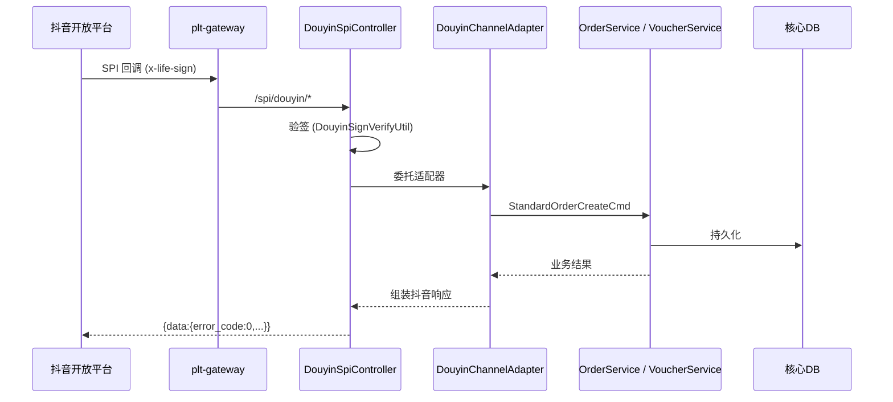

# 抖音渠道 SPI 对接实施计划 (V2 — 团购优先)

> **目标**: 实现 `plt-order-core` 中抖音渠道 SPI 回调的完整骨架，使正向交易链路（下单→发码→核销→退款）可联调验证。  
> **路径变更**: SPI 路径从 `/api/order/douyin/spi/*` 改为 **`/spi/douyin/*`**，不走标准 API 体系。  
> **优先级**: **团购 (B-series) 优先**，日历票 (A-series) 同批实现但排序靠后。  
> **参考**: `.agent/references/ota/douyin/` 下 A10~A33, B10~B30 全部 SPI 文档。

---

## 系统拓扑

> [!IMPORTANT]
> SPI 返回必须是抖音原生格式 `{data:{error_code,...}}`，不走 ResultBody 也不走网关包装。

---

## Phase A: DTO 层 (`channel.douyin.dto`)

通用基础类 + 按业务场景分组的请求/响应 POJO。

| 文件 | 说明 | 来源 |
|------|------|------|
| `DouyinBaseResponse` | 通用 `{data:{error_code, description}}` 包装，含 `success()/fail()/retry()` 工厂方法 | 通用 |
| `DouyinCreateOrderRequest` | 团购预下单 V2 入参 (`order_item_list`, `sku_info_list`, `contact_list`) | B10 |
| `DouyinCreateOrderResponse` | 团购预下单响应 (`order_id`, `ext_order_id`, `fail_sku_id_list`) | B10 |
| `DouyinIssueVoucherRequest` | 团购发码 V2 入参 (`certificate_info_list`, 纳秒时间戳) | B11 |
| `DouyinIssueVoucherResponse` | 团购发码响应 (`result`, `certificate_info[]{project_list}`) | B11 |
| `DouyinRefundApplyRequest` | 退款审核入参 (`biz_uniq_key`, `apply_source`, `after_sale_type`) | B20/A31 |
| `DouyinRefundApplyResponse` | 退款审核响应 (`audit_refund_result`, `refund_fee_amount`) | B20/A31 |
| `DouyinRefundNotifyRequest` | 退款结果通知入参 (`refund_amount`, `refund_scene`) | B22/A33 |
| `DouyinCancelOrderRequest` | 取消订单通知入参 (`cancel_type`) | A30 |
| `DouyinQueryOrderRequest` | 订单状态查询入参 | A12 |
| `DouyinQueryOrderResponse` | 订单状态查询响应 (`total/used_voucher_quantity`) | A12 |
| `DouyinCanBuyRequest` | 预订信息校验入参 | A10 |
| `DouyinCalendarCreateOrderRequest` | 日历票创单入参 (继承/复用团购结构 + `biz_type=2` 扩展) | A11 |
| `DouyinCalendarIssueVoucherRequest` | 日历票发放凭证入参 (`copies`, `vouchers[]` 格式) | A21 |

---

## Phase B: DouyinSpiController 重建 (`channel.douyin.spi`)

路径: **`/spi/douyin/*`**。每个接口: 验签 → 委托 Adapter → 返回抖音原生 JSON。

| 路由 | 团购/日历票 | 方法 | 文档 |
|------|-----------|------|------|
| `POST /spi/douyin/groupbuy/createOrder` | 团购 | `groupbuyCreateOrder()` | B10 |
| `POST /spi/douyin/groupbuy/issueVoucher` | 团购 | `groupbuyIssueVoucher()` | B11 |
| `POST /spi/douyin/groupbuy/refundApply` | 团购 | `groupbuyRefundApply()` | B20 |
| `POST /spi/douyin/groupbuy/refundNotify` | 团购 | `groupbuyRefundNotify()` | B22 |
| `POST /spi/douyin/calendar/canBuy` | 日历票 | `calendarCanBuy()` | A10 |
| `POST /spi/douyin/calendar/createOrder` | 日历票 | `calendarCreateOrder()` | A11 |
| `POST /spi/douyin/calendar/queryOrder` | 日历票 | `calendarQueryOrder()` | A12 |
| `POST /spi/douyin/calendar/issueVoucher` | 日历票 | `calendarIssueVoucher()` | A21 |
| `POST /spi/douyin/calendar/cancelOrder` | 日历票 | `calendarCancelOrder()` | A30 |
| `POST /spi/douyin/calendar/refundApply` | 日历票 | `calendarRefundApply()` | A31 |
| `POST /spi/douyin/calendar/refundNotify` | 日历票 | `calendarRefundNotify()` | A33 |

---

## Phase C: DouyinChannelAdapter 增强

新增 SPI 业务处理方法，桥接到核心层 Service：

| 方法 | 职责 |
|------|------|
| `handleGroupbuyCreateOrder()` | 查 `o_channel_sku_mapping` → 构建 `StandardOrderCreateCmd` → `orderService.createOrder()` |
| `handleGroupbuyIssueVoucher()` | `voucherService.issueVouchers()` → 组装 `certificate_info` 格式 |
| `handleRefundApply()` | 转换退款申请 → `refundApplyService.applyRefund()` → 返回审核结果 |
| `handleRefundNotify()` | 更新退款单终态 → ack |
| `handleCalendarCreateOrder()` | 同团购逻辑，扩展日历票特有字段 |
| `handleCalendarIssueVoucher()` | 同发码逻辑，组装 A21 `vouchers[]` 格式 |
| `handleCalendarCancelOrder()` | `orderService.cancelOrder()` |
| `handleCalendarQueryOrder()` | 查内部订单+凭证状态 → 返回 `total/used_voucher_quantity` |
| `handleCanBuy()` | 校验库存/限购 |

---

## Phase D: 验证
- Maven 编译验证
- 归档计划到 `.agent/plan/order/`
