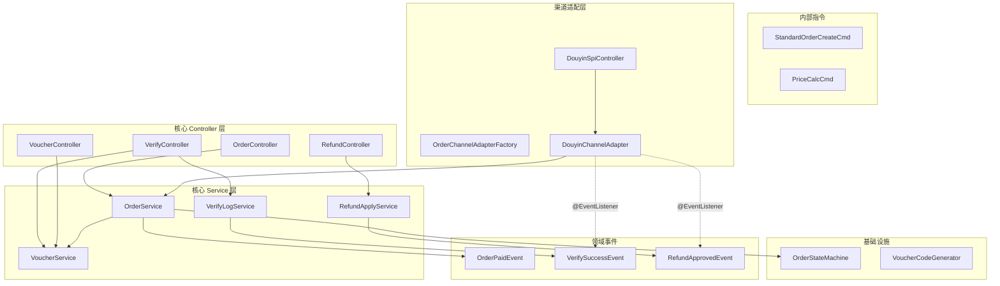

# 统一订单中心骨架搭建实施计划

> **目标**: 根据 UNIFIED_ORDER_FULL_SPEC.md (V5.3) 设计文档，搭建 `plt-order-core` 的系统拓扑骨架。   
> **前提**: Mapper、Service 接口/实现、DB Entity 和枚举类已编码完成，但 Service 方法体和 Controller 层均为空壳。  
> **策略**: 先搭骨架框架，复杂业务逻辑用 `TODO` 标记，主要完成大的架构代码和伪代码。

---

## 组件拓扑概览



---

## Proposed Changes

### Phase A: 领域事件定义

新建 3 个 Spring Domain Event POJO，用于核心层到渠道适配层的单向解耦通信。

#### [NEW] [OrderPaidEvent.java](file:///d:/08-Work/01-博思/10-平台2.0/plt-core-service/plt-order-service/plt-order-core/src/main/java/cn/com/bsszxc/plt/order/event/OrderPaidEvent.java)
- 字段: `orderId`, `orderNo`, `channelCode`, `payAmount`
- 继承 `ApplicationEvent`

#### [NEW] [VerifySuccessEvent.java](file:///d:/08-Work/01-博思/10-平台2.0/plt-core-service/plt-order-service/plt-order-core/src/main/java/cn/com/bsszxc/plt/order/event/VerifySuccessEvent.java)
- 字段: `orderId`, `orderNo`, `voucherCode`, `channelCode`, `verifyLogId`

#### [NEW] [RefundApprovedEvent.java](file:///d:/08-Work/01-博思/10-平台2.0/plt-core-service/plt-order-service/plt-order-core/src/main/java/cn/com/bsszxc/plt/order/event/RefundApprovedEvent.java)
- 字段: `orderId`, `orderNo`, `refundNo`, `channelCode`, `approved`

---

### Phase B: 内部指令对象

统一下单指令，渠道适配层转换后向 Core 层递交的标准模型。

#### [NEW] [StandardOrderCreateCmd.java](file:///d:/08-Work/01-博思/10-平台2.0/plt-core-service/plt-order-service/plt-order-core/src/main/java/cn/com/bsszxc/plt/order/service/cmd/StandardOrderCreateCmd.java)
- 字段: `channelCode`, `channelOrderNo`, `channelUserId`, `userId`, `userAccount`, `clientIp`
- 内嵌 `List<OrderItemCmd>` (每项含 `spuId`, `skuId`, `skuName`, `spuPic`, `price`, `quantity`, `channelSpuId`, `channelSkuId`)
- 内嵌 `BigDecimal totalAmount, payAmount, discountAmount, couponAmount`

#### [NEW] [PriceCalcCmd.java](file:///d:/08-Work/01-博思/10-平台2.0/plt-core-service/plt-order-service/plt-order-core/src/main/java/cn/com/bsszxc/plt/order/service/cmd/PriceCalcCmd.java)
- 字段: 同 `StandardOrderCreateCmd` 的商品部分

---

### Phase C: Controller 骨架

按 SPEC 第八节 API 资产清单，建立 4 个核心 Controller。  
**每个方法实现 = 直接委托给 Service 层，内部逻辑全部在 Service 里。**

#### [NEW] [OrderController.java](file:///d:/08-Work/01-博思/10-平台2.0/plt-core-service/plt-order-service/plt-order-core/src/main/java/cn/com/bsszxc/plt/order/controller/OrderController.java)
- `POST /api/core/order/create` → `OrderService.createOrder(StandardOrderCreateCmd)`
- `POST /api/core/order/cancel` → `OrderService.cancelOrder(orderNo)`
- `GET  /api/core/order/detail/{orderNo}` → `OrderService.getOrderDetail(orderNo)`
- `POST /api/core/order/page` → `OrderService.pageQuery(OrderQueryDO)`
- `POST /api/core/order/pay-callback` → `OrderService.handlePayCallback(...)`
- `POST /api/core/order/calc-price` → `OrderService.calcPrice(PriceCalcCmd)`

#### [NEW] [VerifyController.java](file:///d:/08-Work/01-博思/10-平台2.0/plt-core-service/plt-order-service/plt-order-core/src/main/java/cn/com/bsszxc/plt/order/controller/VerifyController.java)
- `POST /api/core/verify/check` → 核销引擎主入口
- `POST /api/core/verify/manual` → 人工核销

#### [NEW] [RefundController.java](file:///d:/08-Work/01-博思/10-平台2.0/plt-core-service/plt-order-service/plt-order-core/src/main/java/cn/com/bsszxc/plt/order/controller/RefundController.java)
- `POST /api/core/refund/apply` → 发起退票
- `POST /api/core/refund/audit` → 审批退款
- `GET  /api/core/refund/detail` → 退款详情

#### [NEW] [VoucherController.java](file:///d:/08-Work/01-博思/10-平台2.0/plt-core-service/plt-order-service/plt-order-core/src/main/java/cn/com/bsszxc/plt/order/controller/VoucherController.java)
- `GET  /api/core/voucher/query` → 查询凭证
- `POST /api/core/voucher/disable` → 冻结/作废凭证
- `POST /api/core/voucher/delay` → 凭证延期

---

### Phase D: Service 接口方法签名补齐

#### [MODIFY] [OrderService.java](file:///d:/08-Work/01-博思/10-平台2.0/plt-core-service/plt-order-service/plt-order-core/src/main/java/cn/com/bsszxc/plt/order/service/OrderService.java)
新增方法签名:
- `String createOrder(StandardOrderCreateCmd cmd)` → 返回 orderNo
- `boolean cancelOrder(String orderNo)`
- `OrderBO getOrderDetail(String orderNo)`
- `boolean handlePayCallback(String orderNo, String transactionId)`
- `Object calcPrice(PriceCalcCmd cmd)`

#### [MODIFY] [VoucherService.java](file:///d:/08-Work/01-博思/10-平台2.0/plt-core-service/plt-order-service/plt-order-core/src/main/java/cn/com/bsszxc/plt/order/service/VoucherService.java)
新增方法签名:
- `List<String> issueVouchers(Long orderId)` → 为订单所有子项生成凭证
- `VerifyResultVO verify(VerifyRequestDO request)` → 核销凭证
- `boolean lockVoucher(Long voucherId)` → 冻结凭证
- `boolean unlockVoucher(Long voucherId)` → 解冻凭证
- `boolean invalidateVoucher(Long voucherId)` → 作废凭证

#### [MODIFY] [RefundApplyService.java](file:///d:/08-Work/01-博思/10-平台2.0/plt-core-service/plt-order-service/plt-order-core/src/main/java/cn/com/bsszxc/plt/order/service/RefundApplyService.java)
新增方法签名:
- `String applyRefund(RefundAddDO request)` → 返回 refundNo
- `boolean auditRefund(String refundNo, boolean approved, String remark)`
- `RefundBO getRefundDetail(String refundNo)`

#### [MODIFY] [VerifyLogService.java](file:///d:/08-Work/01-博思/10-平台2.0/plt-core-service/plt-order-service/plt-order-core/src/main/java/cn/com/bsszxc/plt/order/service/VerifyLogService.java)
新增方法签名:
- `Long createLog(VerifyLog log)` → 写入核销记录
- `boolean updateNotifyStatus(Long logId, Integer status)` → 更新回写状态

---

### Phase E: ServiceImpl 伪代码骨架

在已有空壳 ServiceImpl 中填入业务主干伪代码，**复杂细节标 `TODO`**。

#### [MODIFY] [OrderServiceImpl.java](file:///d:/08-Work/01-博思/10-平台2.0/plt-core-service/plt-order-service/plt-order-core/src/main/java/cn/com/bsszxc/plt/order/service/impl/OrderServiceImpl.java)
```java
createOrder(cmd):
  1. 生成 orderNo (雪花/UUID)
  2. 构建 Order 实体 → 状态 PENDING → 存主表
  3. 遍历 cmd.items → 构建 OrderItem → 存子表
  4. // TODO: 分布式锁扣减库存
  5. // TODO: 发送 RocketMQ 15分钟延迟关单消息
  6. return orderNo

cancelOrder(orderNo):
  1. 查订单 → 状态机 transition(CANCELED)
  2. // TODO: 释放库存

handlePayCallback(orderNo, transactionId):
  1. 查订单 → 状态机 transition(PAID)
  2. 调 voucherService.issueVouchers(orderId) 发券
  3. 状态机 transition(DELIVERING)
  4. 发布 OrderPaidEvent
```

#### [MODIFY] [VoucherServiceImpl.java](file:///d:/08-Work/01-博思/10-平台2.0/plt-core-service/plt-order-service/plt-order-core/src/main/java/cn/com/bsszxc/plt/order/service/impl/VoucherServiceImpl.java)
```java
issueVouchers(orderId):
  1. 查 orderItems
  2. 按 quantity 逐张生成 Voucher (VoucherCodeGenerator)
  3. 根据 SpuRule 设置有效期
  4. 批量入库 → 返回 voucherCode 列表

verify(request):
  1. 根据 voucherCode 查 Voucher
  2. 校验状态 == USABLE && 未过期
  3. 更新状态 → VERIFIED
  4. 写 VerifyLog
  5. 发布 VerifySuccessEvent
  6. // TODO: 判断订单下所有凭证是否全部核销 → 状态机 COMPLETED
  7. return VerifyResultVO.success(...)
```

#### [MODIFY] [RefundApplyServiceImpl.java](file:///d:/08-Work/01-博思/10-平台2.0/plt-core-service/plt-order-service/plt-order-core/src/main/java/cn/com/bsszxc/plt/order/service/impl/RefundApplyServiceImpl.java)
```java
applyRefund(request):
  1. 查 OrderItem + Voucher 校验状态 (VERIFIED 拒绝)
  2. 冻结对应凭证 → LOCKED
  3. 创建 RefundApply (APPLYING)
  4. 状态机 transition(REFUNDING)
  5. // TODO: 根据 SpuRule.needRefundAudit 自动审批逻辑
  6. return refundNo

auditRefund(refundNo, approved, remark):
  7. 查 RefundApply
  8. if approved:
       RefundApply → APPROVED → SUCCESS
       Voucher → INVALID
       // TODO: 触发资金退款
       状态机判断 → REFUNDED 或保持 DELIVERING (部分退)
       发布 RefundApprovedEvent
  9. else:
       RefundApply → REJECTED
       Voucher → USABLE (解冻)
       状态机恢复 → PAID
```

---

### Phase F: 渠道适配层补齐

#### [MODIFY] [DouyinChannelAdapter.java](file:///d:/08-Work/01-博思/10-平台2.0/plt-core-service/plt-order-service/plt-order-core/src/main/java/cn/com/bsszxc/plt/order/channel/douyin/adapter/DouyinChannelAdapter.java)
新增 `@EventListener` 方法:
- `onVerifySuccess(VerifySuccessEvent e)` → 过滤 channelCode == DOUYIN → 异步回写核销状态
- `onRefundApproved(RefundApprovedEvent e)` → 过滤 channelCode == DOUYIN → 异步回写退款结果
