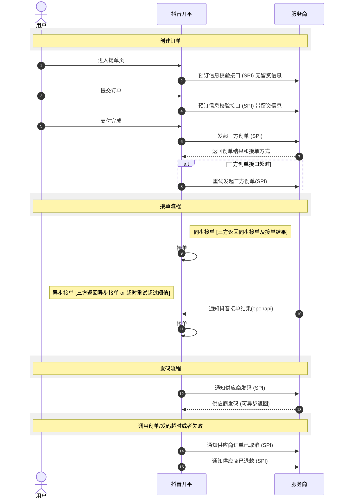
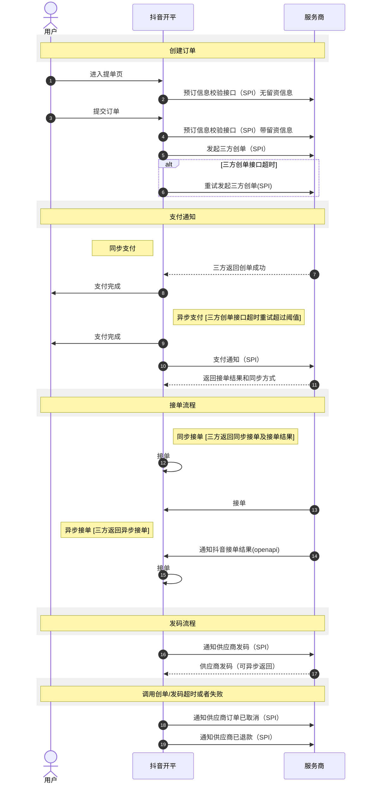
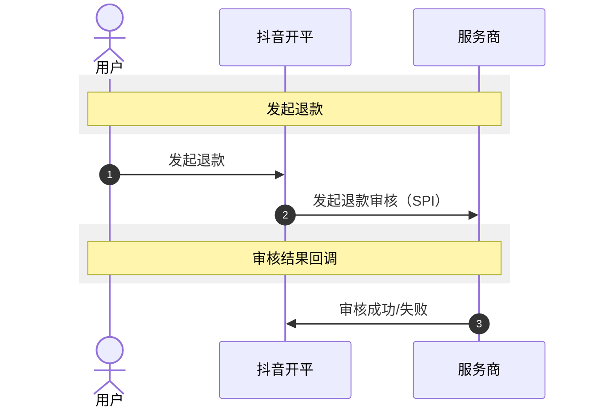
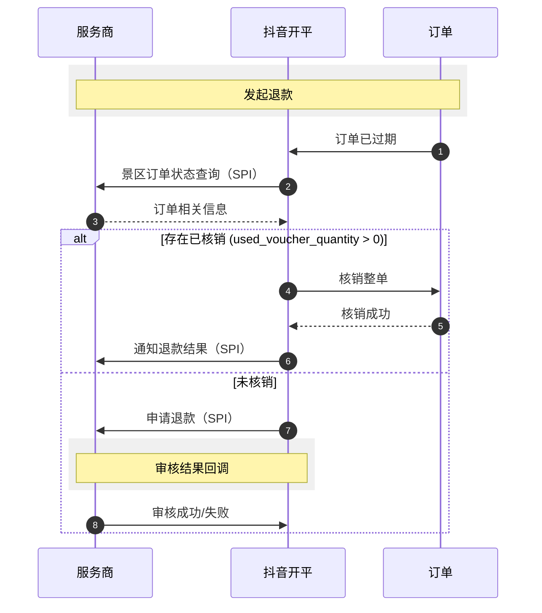

# 景区日历票解决方案

**更新时间**: 2025-11-24 14:52:44

## 业务简介

景区日历票是针对景区类商家开放的、支持用户“先预约，后下单”，且依靠在线预约能力实现的一种抖音本地生活新的原生商品类型。

## 开发者入驻和接入

根据以下指南完成开放平台的入驻和自助化接入：
*   **技术服务商**: [https://developer.open-douyin.com/docs/resource/zh-CN/local-life/connect/partner/tech-service-entry-guide](https://developer.open-douyin.com/docs/resource/zh-CN/local-life/connect/partner/tech-service-entry-guide)
*   **自研商家**: [https://developer.open-douyin.com/docs/resource/zh-CN/local-life/connect/developer/self-developed-merchant-guide](https://developer.open-douyin.com/docs/resource/zh-CN/local-life/connect/developer/self-developed-merchant-guide)

## 产品动线

### 上品动线
*(此处原有上品动线图)*

### 交易动线

*   **支付前/支付后创单**
    *   默认情况下为**支付后创单**，即用户支付后调用三方创单接口，无支付通知。
    *   可联系抖音同学配置为**支付前创单**，即用户下单后立即调用三方创单接口，有支付通知。
*   **同步/异步接单**
    *   支付前创单模式下的支付通知接口返回接单信息，或支付后创单模式下的创单接口返回接单信息，指定接单模式为同步接单或异步接单。
    *   **同步接单模式下**，返回接单结果为接单或拒单。
    *   **异步接单模式下**，需要服务商在创单（支付后创单模式）或支付通知（支付前创单模式）后回调接单或拒单。
*   **创建订单失败也可能会有支付通知**，除非明确拒绝创单。

*   支付后创建

*   支付前创建

### 退款动线
*   用户发起退款

*   过期自动退款

## 能力概览

为商家提供收银 SaaS 接入能力，提高商家经营效率，打造抖音用户线上屯券 - 到店消费的体验闭环。

| 能力 | 是否必接 | 接口文档 | 描述 |
| :--- | :--- | :--- | :--- |
| **门店查询** | 可选 | 门店关联及匹配 | 通过系统获得商家/服务商自己系统中的门店，所对应的抖音 POI id，商家可自行做门店关联，方便做后续团购创建和分店结算核销能力。 |
| **订单查询** | 可选 | 订单查询 | 通过接口查询订单详情，来确认两个平台订单状态。 |
| **商品发布&查询** | 可选 | 团购发布查询 | 商户通过开放平台接入，能够通过系统将商品批量创建到抖音，同时可以做到商品库存、状态等信息的实时同步。针对服务商，或者 SKU 很多的商家，可以提升商品的管理效率，降低商家多平台经营的成本。 |
| **景区创建订单** | **必须对接** | 创建订单（SPI） | 抖音侧通知第三方创建景区订单。ClientKey 维度默认配置是 抖音侧支付成功后 通知第三方创单，不额外通知支付成功。 |
| **景区订单状态查询** | **必须对接**(支持过期自动退必接) | 景区订单状态查询 SPI | 抖音侧通知第三方创建景区订单。请求第三方获取订单核销状态，也关系到对账。 |
| **景区回调审核退款** | **异步审核必须对接**(同步审核可通过申请退款代替) | 回调审核退款 | 抖音侧请求第三方申请退款后，第三方异步回调审核结果。当退款审核结果为接受，若传入手续费小于等于平台计算手续费，以平台计算罚金为准，否则视为拒绝。 |
| **景区履约验券** | **必须对接** | 履约验券 | 履约验券接口。 |
| **景区确认订单** | 不建议对接(可以配置自动接单) | 确认订单 | 抖音侧通知第三方支付成功后，第三方需要在十分钟内通知抖音侧接单结果。 |
| **景区取消订单通知** | **必须对接** | 通知取消订单（SPI） | 抖音侧通知第三方取消订单，仅对未核销订单，当用户退款或取消订单时会通知。 |
| **景区退款结果通知** | **必须对接** | 通知退款结果（SPI） | 抖音侧完成退款后，通知第三方实际退款结果。 |
| **景区退款审核** | **必须对接** | 申请退款（SPI） | 1. 抖音侧请求第三方申请退款，允许同步返回审核结果。当退款审核结果为接受，若传入手续费小于等于平台计算手续费，以平台计算罚金为准，否则视为拒绝。2. 客服发起的退款为免审退款，不会通过此接口请求第三方。 |
| **景区预订信息校验** | **必须对接** | 预订信息校验（SPI) | 用于消费者预订前的信息校验，包括库存和限购规则等，保障消费者提交订单后不会因为库存不足或其他业务规则被拒单。 |
| **景区支付通知** | 可选对接(可以选择支付后再创建订单则不用对接此接口) | 通知支付结果（SPI） | 抖音侧通知第三方支付成功。ClientKey 维度默认配置是 抖音侧支付成功后 通知第三方创单，不额外通知支付成功。 |
| **日历票价格库存属性发布** | **全直连必须对接****半直连**：系统方有设置库存则必接 | 日历票价格库存属性发布 | 用于价格库存信息同步。 |
| **批量拉取价格库存** | 仅对接此接口后来客端才展示拉取按钮 | 批量拉取价格库存 | 商品价格库存主动拉取接口，商家在抖音来客维护日历票价库时点击拉取按钮拉取系统商侧设置的库存。后续可订检查失败后也会有拉取机制。 |
| **日历票价格库存属性批量发布** | 可选对接，建议接入 | 日历票价格库存属性批量发布 | 该接口增量更新价格库存，即只更新此次请求涉及的时间段价格和库存。 |
| **日历票商品查询** | 全直连建议对接 | 日历票商品查询 | 日历票商品查询。 |
| **日历票商品发布** | **全直连必须对接** | 日历票商品发布 | 用于创建和更新日历票商品信息。 |
| **日历票审核结果同步** | 全直连建议对接 | 日历票审核结果同步（webhook） | 用于商品审核完以后向商家通知审核结果。（WebHook 可能丢失） |
| **三方码发布** | **必须对接** | 发放凭证 | 抖音侧服务商接单成功后后向服务商发起发放凭证申请。 |
| **发码回调接口** | **异步返回凭证必须对接**(同步返回凭证可通过发放凭证代替) | 发码回调接口 | 抖音侧先申请服务商发码，如果能同步返回结果则不需要本接口，如果异步返回结果则调用本接口通知抖音。 |
| **商品发布** | **全直连必须对接** | 商品上下架 | 上下架商品。 |
| **门店管理** | 全直连建议对接 | 保存人群适用条件 | • 商品如果没有适用人群限制，可不设置适用人群。如果有限制，需要先创建适用人群，才能创建商品关联适用人群。• 创建预售券适用人群信息，可配置儿童、成人、老人 3 种人群。老人不允许设置身高条件。儿童、成人、老人，扩充枚举，学生、特殊人群、男士、女士、团体、情侣。• 对于相同的 poi_id 重复创建会被覆盖。只能新增和修改人群，不能删除已有人群。• 如果商品不需要区分人群则可以不对接该接口。 |
| **查询门店信息** | 可选 | 查询门店信息 | 查询门店基本信息。 |
| **门店亮照** | 可选 | 门店亮照 | 对未亮照门店进行亮照，对已亮照门店进行资质修改。 |
| **门店装修** | 可选 | 提交门店装修任务 | 对门店进行装修。 |
| **门店基础信息更新** | 可选 | 提交门店基础信息更新任务 | 指定一个抖音 POI，对 POI 的基础信息进行举证和编辑，更新结果请通过“任务结果查询接口”获取。 |
| **门店任务查询** | 可选 | 门店任务查询 | 用于品牌同步、门店同步、门店亮照、门店信息更新、门店装修等异步任务结果查询。 |
| **对账** | 可选 | 团购对账 | 券码核销之后查询对应的分账单。 |