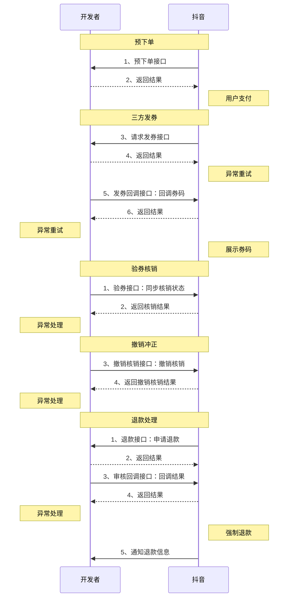

# 景区团购三方码对接方案

**更新时间**: 2025-11-24 14:52:45

## 业务介绍

### 更新日志

| 日期 | 说明 |
| :--- | :--- |
| 2025年6月9日 | **接口更新**：新增支持多 SKU 下单，如之前接入过通用版团购下单能力需要迁移到此接口。**更新说明**：需要接入后能够兼容老接口，接入开通后将不再调用老接口下单，单 SKU 和多 SKU 订单都通过此接口创单；完成接入验收后，需要 TS 团队配置 client_key 方能生效，切换过程中，需注意老接口和新接口兼容逻辑。 |
| 2025年6月6日 | 创建文档 |

### 场景简介

团购商品是针对景区类商家开放的、支持用户线上购买，直接线下到景点进行使用的一种产品形态。主要针对有自己券码体系的商家或者服务商，用户在抖音下单，然后发商家的券码。支持景区商家三方码申请。

### 名词解释

| 名词 | 解释 |
| :--- | :--- |
| **团购** | 商品用户购买时无需指定出行日期，购买后一段时间有效 或是 商家指定的一段时间内有效 |

## 接入流程

### 开发者入驻和接入

根据以下指南完成开放平台的入驻和自助化接入：

*   **技术服务商**: [https://developer.open-douyin.com/docs/resource/zh-CN/local-life/connect/partner/tech-service-entry-guide](https://developer.open-douyin.com/docs/resource/zh-CN/local-life/connect/partner/tech-service-entry-guide)
*   **自研商家**: [https://developer.open-douyin.com/docs/resource/zh-CN/local-life/connect/developer/self-developed-merchant-guide](https://developer.open-douyin.com/docs/resource/zh-CN/local-life/connect/developer/self-developed-merchant-guide)

### 特殊行业类目开通条件、流程

仅适用于景区团购场景的开通。

### 对接流程

## 接口清单(见BXX开头的接口文档)

| 能力名称（权限） | 接口链接 | 调用方 | 是否必接 | 接口说明 |
| :--- | :--- | :--- | :--- | :--- |
| **三方码发布**景区团购预下单接口 V2 | - | 抖音 | **是** | 抖音侧通知第三方创建景区订单。1. ClientKey 维度默认配置是 抖音侧支付前 通知第三方创单，不额外通知支付成功。2. 抖音请求第三方超时，默认创单成功，抖音会走后续链路支付订单；3. 该接口支持多 SKU 下单，如之前接入过通用版团购下单能力需要迁移到此接口。**注意**：需要接入后能够兼容老接口，接入开通后将不再调用老接口下单，单 SKU 和多 SKU 订单都通过此接口创单；完成接入验收后，需要 TS 团队配置 client_key 方能生效，切换过程中，需注意老接口和新接口兼容逻辑。 |
| **景区团购发码 V2** | - | 抖音 | **是** | 景区团购三方码发券 SPI，抖音通知三方发码，如果为同步发码则返回三方码，异步发码则根据发码通知的凭证单的映射关系异步发放三方码。1. 对接方需保证，当凭证回调给抖音成功后才可用。用户才能入园使用凭证。2. 抖音侧服务商接单成功后向服务商发起发放凭证申请。3. 同步发码在 10 分钟内无法获取服务商码时，系统将自动退款并发起退款流程。4. 如果同步无法完成发码，可接入异步链路。5. 该接口支持多 SKU 下单，如之前接入过通用版团购发码能力需要迁移到此接口。**注意**：需要接入后能够兼容老接口，接入开通后将不再调用老接口发码，单 SKU 和多 SKU 订单都通过此接口发码；完成接入验收后，需要 TS 团队配置 client_key 方能生效，切换过程中，需注意老接口和新接口兼容逻辑。 |
| **景区团购发码回调 V2** | - | 商家 | 否 | 景区团购发码回调支持多 sku。 |
| **退款审核接口** | - | 抖音 | **是** | 抖音侧向服务商发起退款的申请，务必做到接口幂等。 |
| **审核回调接口** | - | 商家 | 否 | （非必需）退款申请后，商家/服务商统一退款或拒绝退款的回调通知，若在退款申请时能明确给出结果则不需要再回调。 |
| **退款结果通知** | - | 抖音 | **是** | 商家在抖音 App 进行退款审核操作或者退款被自动审核 (24 小时超时，运营强制退等) 时，动作并非由服务商发起，如果服务商系统需要感知这部分信息，可实现该接口，抖音侧会同步审核信息。 |
| **核销团购**景区验券接口 | - | 商家 | **是** | 同时适用于抖音券码与三方券码，抖音券码的核销需要先调用准备接口，再调用本接口，三方券码的核销直接调用本接口即可。 |