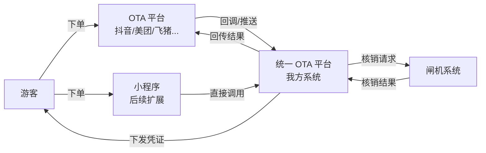
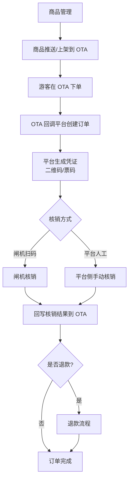
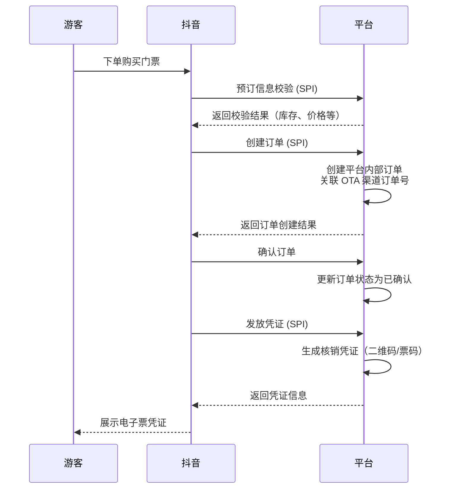
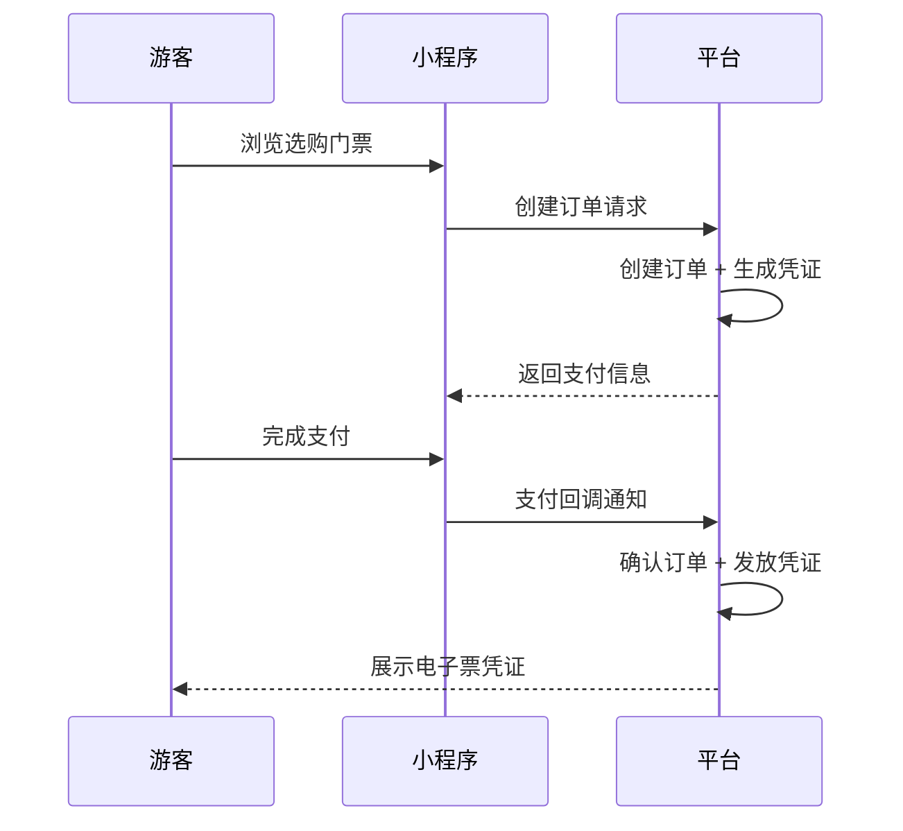
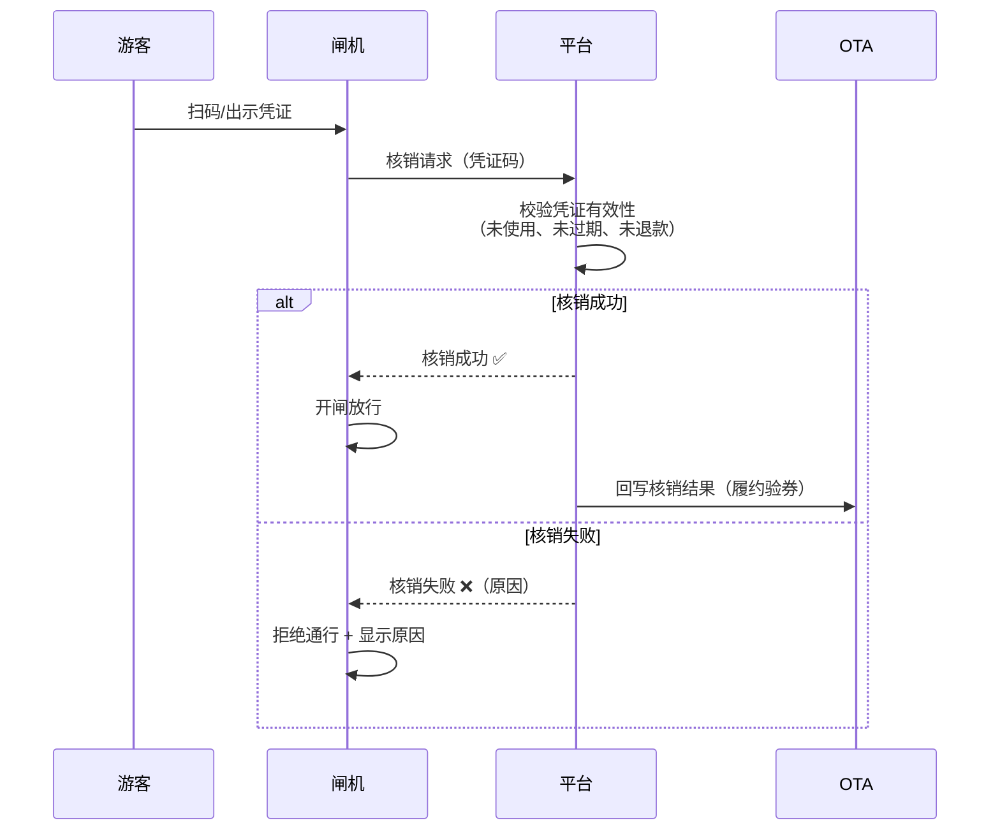
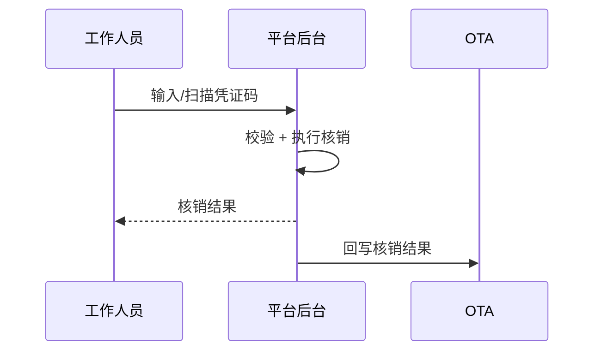
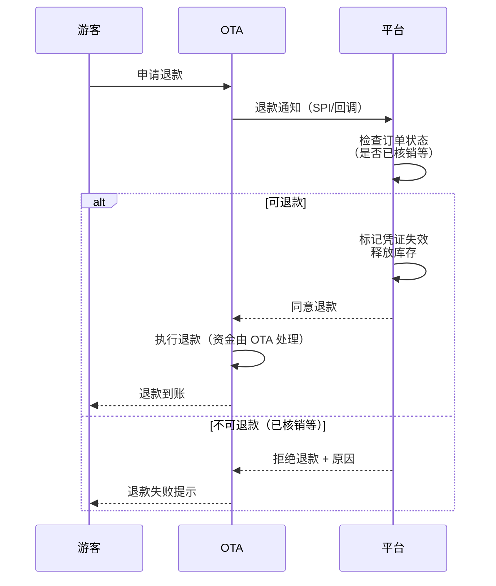
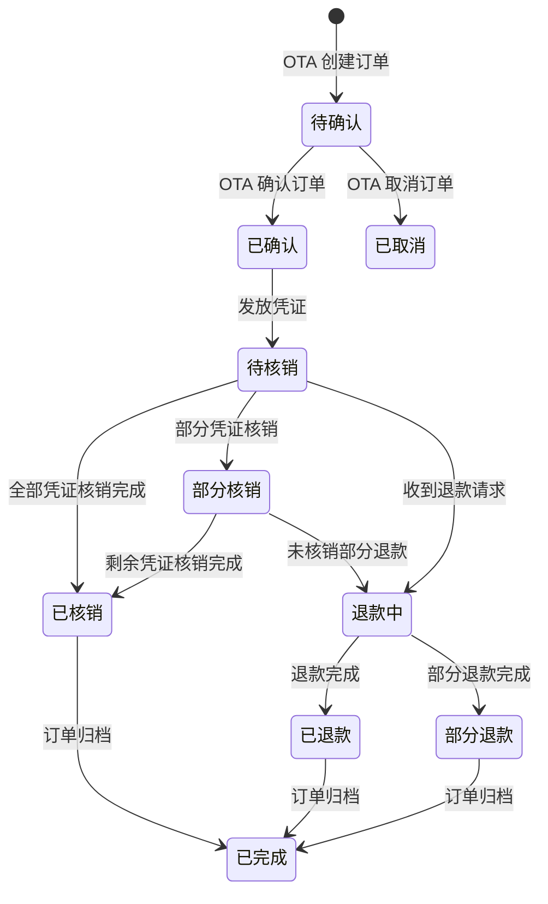

# OTA 统一接入平台 — 业务需求文档 (BRD)

> **版本**: v1.1  
> **创建日期**: 2026-03-19  
> **最后更新**: 2026-03-19（已确认关键决策）  
> **状态**: 已确认  
> **MVP 目标渠道**: 抖音 OTA  
> **后续扩展渠道**: 美团/大众点评、飞猪、携程、快手、小程序自有渠道

---

## 1. 业务背景

景区/文旅商户需要在多家 OTA 平台（抖音、美团、飞猪等）上架门票商品进行分销，游客在 OTA 下单后，需凭电子凭证到景区闸机核销入园。

**当前痛点**：
- 各 OTA 平台接口协议不统一，每接一家都要单独开发
- 订单与凭证无法统一管理，多渠道间容易产生重复核销、漏核销等问题
- 闸机系统对接的是平台自有系统，OTA 侧的订单数据无法直接用于闸机核销

**解决方案**：
建设一个 **统一 OTA 接入平台**，向上对接各 OTA 厂商，向下统一提供订单、凭证、核销、退款等能力，对外暴露标准化的 OTA 接口。

---

## 2. 业务目标

| # | 目标 | 说明 |
|---|------|------|
| G1 | 多渠道统一接入 | 一次建设 OTA 适配层，后续新增 OTA 渠道仅需扩展适配器 |
| G2 | 统一核销体验 | 无论订单来源（OTA / 小程序），闸机核销使用同一套凭证和接口 |
| G3 | 统一订单管理 | 所有渠道订单归集到平台，支持统一查询、对账 |
| G4 | 可扩展 | 预留小程序自有渠道下单能力，架构不绑定特定 OTA |

---

## 3. 业务参与方

| 参与方 | 角色 | 职责边界 |
|--------|------|----------|
| **游客** | 终端用户 | 在 OTA/小程序浏览、下单、获取凭证、到场核销 |
| **OTA 平台** | 分销渠道 | 承载用户下单入口，按接口协议回调平台 |
| **统一 OTA 平台（我方）** | 订单与核销中枢 | 接收订单、生成凭证、编排核销与退款流程 |
| **闸机系统** | 线下核销终端 | 扫码验证凭证，向平台发起核销请求，回传结果 |
| **商户/运营人员** | 管理角色 | 商品管理、订单查看、退款审核 |

---

## 4. 业务流程

### 4.1 全局流程总览

### 4.2 各场景详细流程

#### 场景一：商品录入与上架

**业务需求**：商户在平台录入门票商品信息（名称、价格、日历库存、使用规则等），平台将商品推送到指定 OTA 渠道进行上架。

**流程**：
1. 运营人员在平台后台录入商品（票型、价格日历、库存等）
2. 选择目标 OTA 渠道，发起上架
3. 平台调用 OTA 接口推送商品
4. OTA 审核通过后，商品在 OTA 平台上线可售

**MVP 范围**：本期 MVP 暂不实现自动推送，商品在抖音后台手动管理，**优先聚焦下单→核销→退款的闭环流程**。

> [!IMPORTANT]
> **商品映射策略（已确认）**：MVP 阶段平台维护一份**商品映射表**（平台商品 ID ↔ OTA 商品 ID），即使 MVP 不做自动推送。原因：
> - 凭证关联平台商品 ID 而非 OTA 外部 ID，天然支持多渠道核销
> - 后续新增渠道或小程序时不需反向补全映射关系，扩展成本低
> - MVP 实现成本低，仅一张映射表 + 手动录入

> [!NOTE]
> **库存策略（已确认）**：MVP 阶段库存由 OTA 侧管理，平台仅做预留接口。后续如需平台统一管库存，可通过商品映射关系平滑过渡。

---

#### 场景二：OTA 下单（核心流程）

**业务需求**：游客在 OTA 平台（如抖音）购买门票后，OTA 通过回调接口通知平台创建订单并发放核销凭证。

##### 抖音 OTA 下单流程

**关键业务规则**：
- 平台订单须关联 OTA 渠道标识 + OTA 侧订单号，确保可溯源
- **一单多票采用独立凭证（已确认）**：一笔 OTA 订单可包含多张门票，每张票对应独立凭证。独立凭证扩展性更好，支持部分核销、部分退款等场景
- 凭证格式：二维码或数字票码，须全局唯一
- **凭证有效期可配置（已确认）**：支持按商品/票型配置有效期规则（当日有效、指定日期、N 日有效等）
- 订单状态需在平台和 OTA 之间双向同步

##### 小程序下单流程（后续扩展）

**与 OTA 下单的主要差异**：

| 对比项 | OTA 下单 | 小程序下单 |
|--------|---------|-----------|
| 发起方 | OTA 平台回调通知 | 小程序主动调用平台接口 |
| 支付 | OTA 侧完成支付，平台不介入 | 平台负责支付（对接微信支付等） |
| 订单归属 | 订单在 OTA 和平台各有一份 | 订单仅在平台 |
| 凭证发放 | OTA 请求平台发券，平台返回凭证信息 | 平台直接发放凭证给用户 |
| 退款 | OTA 发起退款通知平台 | 用户在小程序申请，平台自行处理 |
| **核销流程** | **完全一致** | **完全一致** |

> [!IMPORTANT]
> **共同点**：无论订单来源是 OTA 还是小程序，核销（闸机/人工）流程完全一致。这是统一平台设计的核心价值——闸机只需对接平台凭证系统，不需要关心订单来源。

---

#### 场景三：核销（核心场景）

**业务需求**：游客到达景区后，凭电子凭证（二维码/票码）在闸机或人工窗口完成核销入园。

##### 闸机核销流程（主要场景）

##### 平台人工核销流程

**关键业务规则**：
- 同一凭证核销成功后，不得重复核销
- 核销前需校验：凭证是否存在、是否已使用、是否已过期、是否已退款
- 一单多票场景：每张票独立核销，部分核销不影响其他票
- 闸机需支持**离线/弱网场景**下先放行后补传核销结果
- 核销成功后须异步通知 OTA 侧（不同 OTA 的通知接口不同，由适配层处理）

---

#### 场景四：退款

**业务需求**：用户需要退款时，OTA 平台通知我方进行退款审核和处理。

##### OTA 退款流程

**关键业务规则**：
- 已核销的凭证默认不可退款（可配置策略）
- 一单多票场景支持部分退款（退未核销的票）
- 退款后对应凭证须立即失效，防止退款后核销
- OTA 侧处理资金退款，平台不经手资金
- **退款审核策略可配置（已确认）**：支持配置为自动通过或人工审核，可按商品/渠道粒度设置

---

#### 不同 OTA 厂商流程一致性分析

根据调研，各 OTA 厂商的**业务流程在宏观上是一致的**，差异主要体现在**接口协议层面**：

| 流程环节 | 业务逻辑是否一致 | 接口差异说明 |
|----------|:----------------:|-------------|
| 下单 | ✅ 一致 | 抖音用 SPI 回调，美团用消息推送，飞猪用主动拉取+回调组合 |
| 发放凭证 | ✅ 一致 | 凭证格式一致，但返回方式和时机因平台而异 |
| 核销 | ✅ 一致 | 平台侧核销逻辑不变，仅回写 OTA 的接口不同 |
| 退款 | ✅ 基本一致 | 飞猪额外支持平台侧主动发起退款，其他 OTA 仅支持 OTA 侧发起 |
| 商品管理 | ⚠️ 差异较大 | 各平台的商品模型、价格日历、审核流程差异较大 |

> [!TIP]
> **架构启示**：核心业务逻辑（订单、凭证、核销、退款）可以做成通用的领域层，各 OTA 的差异通过"渠道适配器"模式在接口层隔离。

---

## 5. MVP 范围定义

### 5.1 MVP 纳入范围（本期交付）

| # | 功能项 | 优先级 | 说明 |
|---|--------|:------:|------|
| F1 | 抖音 OTA 下单接入 | P0 | 支持预订校验、创建订单、确认订单、发放凭证 |
| F2 | 统一凭证管理 | P0 | 生成全局唯一凭证码，每张票独立凭证，有效期可配置 |
| F3 | 闸机核销 | P0 | 平台定义闸机对接协议，支持凭证码核销 |
| F4 | 平台人工核销 | P0 | 运营后台手动核销 |
| F5 | 核销结果回写 OTA | P0 | 核销后通知抖音更新履约状态 |
| F6 | 退款处理 | P0 | 接收抖音退款通知，支持自动/人工审核（可配置） |
| F7 | 订单管理 | P1 | 运营后台查看/管理 OTA 渠道订单 |
| F8 | 渠道适配器架构 | P1 | 隔离 OTA 差异，为后续新渠道扩展做准备 |
| F9 | 商品映射管理 | P1 | 维护平台商品与 OTA 商品的映射关系 |

### 5.2 MVP 不纳入范围（后续迭代）

| # | 功能项 | 计划迭代 | 说明 |
|---|--------|----------|------|
| NF1 | 商品自动推送到 OTA | 二期 | 本期商品在抖音后台手动管理 |
| NF2 | 美团/大众点评接入 | 二期 | 复用适配器架构，新增美团渠道适配器 |
| NF3 | 飞猪接入 | 三期 | 新增飞猪渠道适配器 |
| NF4 | 小程序自有渠道下单 | 待定 | 复用平台订单和凭证能力 |
| NF5 | 离线/弱网核销补传 | 二期 | 闸机离线场景的补偿机制 |
| NF6 | 库存同步 | 二期 | 多渠道库存联动 |
| NF7 | 对账与结算 | 后续 | 对账报表、资金核对 |

---

## 6. 非功能性需求

| # | 需求 | 说明 |
|---|------|------|
| NR1 | 核销响应时间 | 闸机核销接口响应 ≤ 500ms（影响游客通行体验） |
| NR2 | 凭证安全性 | 凭证码不可预测，防止伪造 |
| NR3 | 幂等性 | OTA 回调和核销请求需支持幂等，防止重复操作 |
| NR4 | 可追溯性 | 订单全生命周期状态变更需记录日志 |
| NR5 | 渠道隔离 | 单个 OTA 渠道异常不影响其他渠道和核销服务 |

---

## 7. 订单状态机

---

## 8. 术语表

| 术语 | 含义 |
|------|------|
| OTA | Online Travel Agency，在线旅游代理平台（抖音、美团、飞猪等） |
| SPI | Service Provider Interface，OTA 平台调用我方实现的接口 |
| 凭证 | 核销码，游客凭此在闸机/人工窗口入园的电子票据 |
| 渠道 | 订单来源，如"抖音"、"美团"、"小程序"等 |
| 适配器 | 将各 OTA 差异化的接口协议转换为平台统一内部接口的组件 |
| 履约 | OTA 术语，指完成凭证核销的过程 |

---

## 9. 已确认决策记录

| # | 问题 | 决策 | 理由 |
|---|------|------|------|
| D1 | 商品映射关系 | ✅ MVP 阶段平台维护商品映射表（平台 ID ↔ OTA ID），商品本身在 OTA 后台手动管理 | 映射表实现成本低，且为后续多渠道扩展、小程序自有商品管理打好基础 |
| D2 | 库存管理 | ✅ MVP 阶段库存由 OTA 侧管理，平台预留库存接口 | 跟随商品管理策略，后续通过映射关系可平滑接入平台库存 |
| D3 | 退款策略 | ✅ 可配置，支持自动审批和人工审核两种模式 | 灵活适配不同商户需求 |
| D4 | 一单多票 | ✅ 每张票独立凭证 | 扩展性更好，支持部分核销、部分退款；行业通用做法 |
| D5 | 闸机对接协议 | ✅ 暂无现有协议，由平台自行定义 | 需在技术设计阶段定义闸机核销 API 协议 |
| D6 | 凭证有效期 | ✅ 通过配置支持多种有效期规则 | 按商品/票型配置：当日有效、指定日期、N日有效等 |
